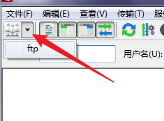
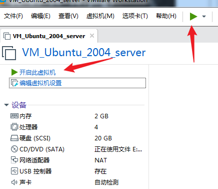
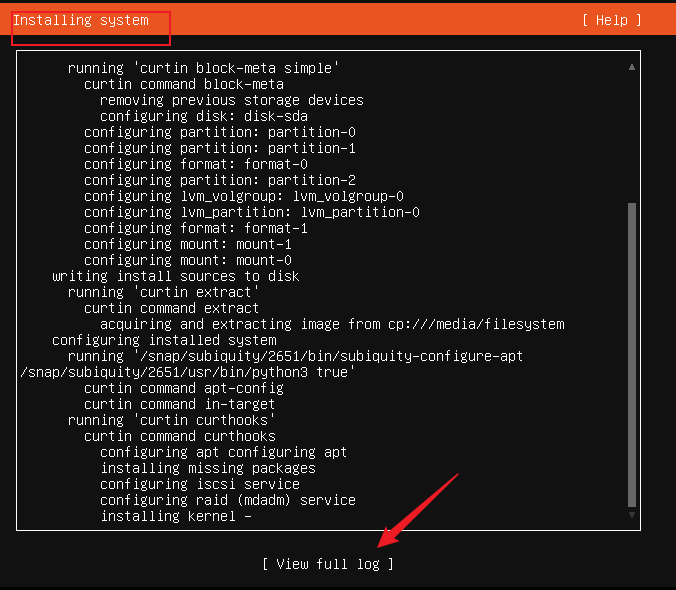
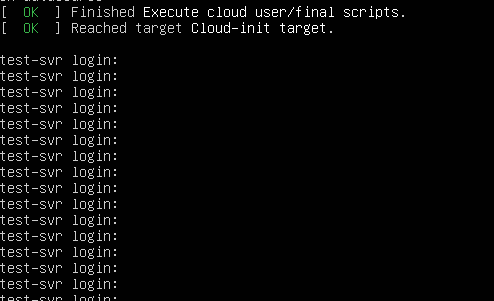

# Linux系统应用

## 泛雅
1. 签到
2. 作业
3. 上课笔记，资料 / 视频 -> B站
4. 考试


## 考察方式
1. 平时:期末 = 3:7
2. 平时，签到 + 作业
3. 期末，闭卷上机，泛雅考试

## 我
1. 邓招奇
2. B706
3. 课后问题
   - 学习通
   - QQ: 5396 2791  <-  学委  备注
   - email: zhaoqid@zsc.edu.cn
4. 尽量在课上提问

## 课程
1. 内容：Linux系统的使用，管理，编程工具，系统编程，shell编程，数据处理
2. 编程
   - C语言
   - 系统调用
3. shell 脚本
   - 利用shell流程控制，融合Linux命令，完成自动化的操作

## 系统


## Linux发行版
1. Windows 版本 1.0 -> 11
   - Desktop
   - Server
2. RedHat 商业版
   - 免费的社区版
   - Fedora 桌面 
   - CentOS 服务器  -> 利用命令行来操作系统
3. Debian 免费
   - Ubuntu 桌面 / 服务器
   - 偶数年的4月份，发布LTS，5-7年
   - 2204 LTS
   - 其他短期版本，9个月
4. ArchLinux
5. 发行版的下载
   - 官网
   - [清华](https://mirrors.tuna.tsinghua.edu.cn/)
   - ISO文件

## 实验室FTP
1. ubuntu-20.04.3-live-server-amd64.iso
2. Filezilla 
   
3. FTP 
   
4. 目录
   
5. 直接拖动下载
   - 默认下载 当前登录用户的 DZ C:\Users\DZ\

## 安装Linux系统
1. 真实硬件上安装
   - 已有Windows 
   - Ubuntu 和 Win 共存
   - 小心，不要丢数据，免责声明
   - ISO镜像 -> U盘
2. 建议初学者，在虚拟硬件上安装
3. 虚拟机: 在宿主Windows下，用软件的方式模拟一台电脑，不破坏宿主机系统和数据
4. 虚拟机软件
   - WmWare WorkStation 商业版 
   - WmWare Player 
   - Virtual Box    

## 新建虚拟机
1. Vm 
   
2. 新建虚拟机
   
3. 典型 
   
4. 稍后安装 
   
5. Ubuntu 64 
   
6. 名字和保存目录
   
7. 硬盘
   
8. 自定义硬件
   
9. 假设完成 -> 编辑虚拟机设置
    
10. CPU 
    
11. 设置光盘镜像位置
    

## Markdown / md 文件
1. typora打开
2. 安装 typora-setup-x64.exe
3. 或者 VS code 
   - 需要 安装 Markdown 插件
  
## 安装系统 
1. power on 
   
2. 鼠标点进 虚拟机 
   - Ctrl + Alt 退出虚拟机
3. 只能用键盘
   - 上下键，或者 tab键 
   - Enter 确定，下一步
4. 选择语言
   
5. 不更新 installer 
   
6. 键盘布局 默认 English 
   
7. 自动获得IP地址
   
8. 代理服务器为空
   
9. 设置mirror address 
   - https://mirrors.huaweicloud.com/ubuntu
   
10. 使用整个磁盘
    
11. 磁盘分区信息
    
12. 确认磁盘操作
    
13. 设置用户名密码  test / asdf 
    
14. 默认不安装 Openssh server
    
15. 默认不选择安装任何服务
    
16. 安装系统
    
17. Complete 安装完毕
18. 重启 
19. reboot 
20. Enter


## 启动系统
1. 按几下Enter，看到登录提示
   
2. 登录，输入用户名，密码
   
3. 欢迎界面
   

## 远程控制 
1. 使用场景
   - 阿里云服务器，公网IP，在本地远程控制，SSH协议
   - 实验室服务器
2. 演示
   - 虚拟机Linux服务器系统，当做远程服务器
   - Windows宿主机当做本地环境
   - 通过网络协议，SSH

## 确保网络畅通
1. Windows ping通 虚拟机IP
2. 首先要知道虚拟机IP地址
   - 欢迎界面里看见IP
   - 或者，通过其它软件查看
3. 安装 net-tools
```shell
sudo apt install net-tools
``` 
4. sudo 需要 输入密码

5. 安装过程
   
6. ifconfig 192.168.233.129
   
7. windows 利用 cmder 
   
8. ping 192.168.233.129 
9. ping通
   
10. 假设ping超时，网络属性
    
11. 更改适配器设置
    
12. 启用两块虚拟网卡
    

## SSH
1. 宿主机windows --SSH--> 虚拟机Linux
2. 虚拟机Linux 开启SSH服务
3. 安装 openssh-server
```shell
sudo apt install openssh-server
```
4. 安装需要确认
   
5. 回到windows Cmder 
   - ssh 用户名@虚拟机IP地址
   - ssh test@192.168.233.129 
6. 确认
   
7. 输入密码，进入欢迎页面

## 部署web服务
1. 虚拟机里安装nginx 
```shell
sudo apt install nginx
```
3. sudo reboot 重启虚拟机 
1. 在windows 利用 浏览器 访问 虚拟机IP地址
   - http 协议 
   - nginx 默认主页
   - http://192.168.233.129/
4. 默认主页
   

## 定制web服务的主页
1. windows 新建 index.html 文件
   
2. 修改index.html源码
```html
<!DOCTYPE html>
<html>
<head> 
<meta charset="utf-8"> 
<title>菜鸟教程(runoob.com)</title> 
</head>
<body>

<h2>Norwegian Mountain Trip</h2>


</body>
</html>
```

## 主页文件放到nginx目录
1. 利用filezilla，上传到虚拟机
   
2. stfp 文件传输服务，是ssh附属
3. 直接把index.html 上传 到 虚拟机
4. 把 index.html 复制到 nginx 主目录
```shell 
sudo cp index.html /var/www/html 
```

5. 图片上传到虚拟机
6. 复制图片到 nginx主目录
```shell
sudo mkdir /var/www/html/images
sudo cp pulpit.jpg /var/www/html/images
```
