# lec-002

## review
1. Linux 发行版
2. 虚拟机 
3. 安装Server，仓库地址，磁盘分区，用户名/密码
4. 远程控制 ssh 
   - Linux ssh 服务 
   - windows ssh 客户端  cmder
5. web/http 服务
   - nginx
   - 修改主页Html

## Xubuntu-dektop
1. Ubuntu衍生版
2. VM_12_Xubuntu_2004
3. 主要还是用命令行的方式来操作
4. Terminal 
   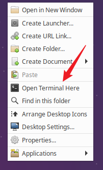
5. 命令行
   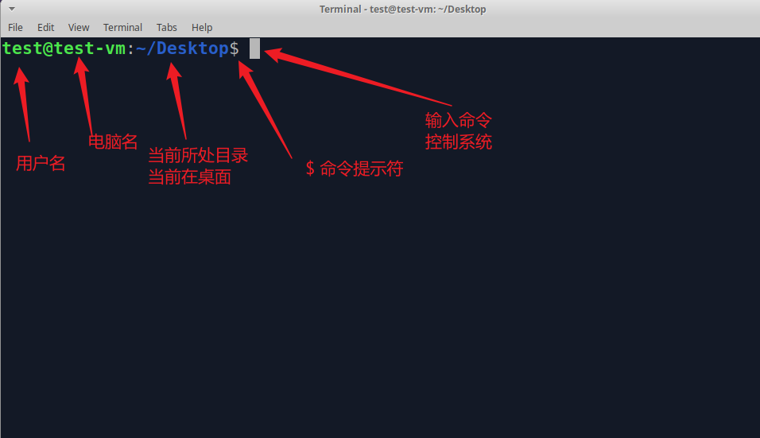
6. 重启 sudo reboot 
   - asdf 
   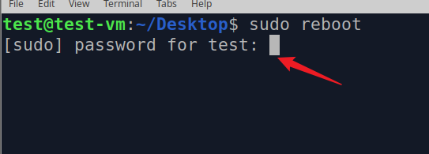
7. 登陆  test / asdf  
   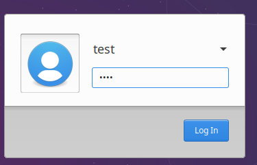

---

## ssh 远程控制Xubuntu 
1. net-tools，openssh-server 都已经安装过了
2. Linux查看IP， ifconfig 
3. Windows， 启用两块虚拟网卡
4. Windows，ping通 IP地址
5. Windows， ssh  test@IP地址 

## 命令控制系统的基本格式
1. 在命令提示符$，之后输入命令，Enter 运行
2. [sudo]  命令  [参数]  [选项]
   - []代表可选
   - 注意中间的空格 
   - ifconfig  仅有命令 
   - sudo reboot  有sudo 
   - ls /var 有参数 
   - ls /var -a 参数 + 选项 
   - 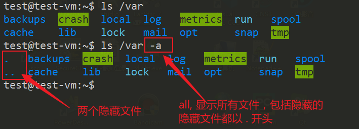
   - ls /var -al  选项合并 
   - 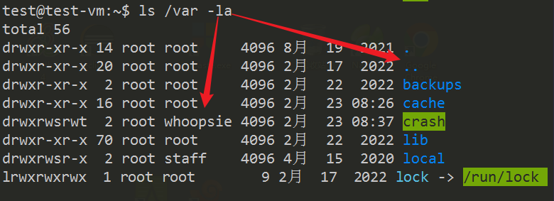
   - ls 没有参数 
   - /home/test 
    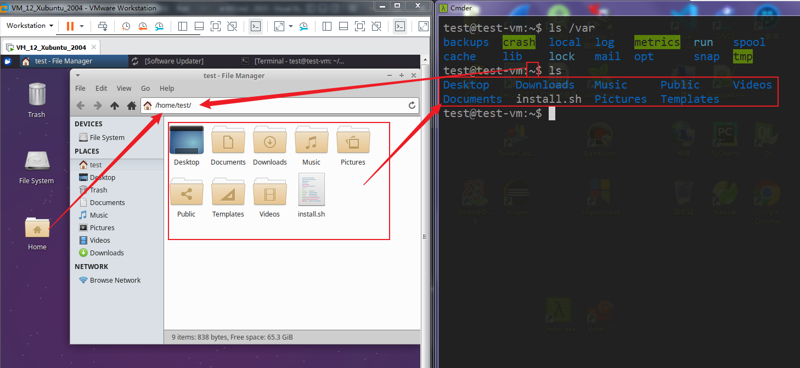

## 陌生命令获得帮助
1. google / bing  搜索 陌生命令 
2. 专业的Linux帮助网站
   - [Linux命令大全](https://www.linuxcool.com/)
3. man 
   - mannual 
   - man ls 
   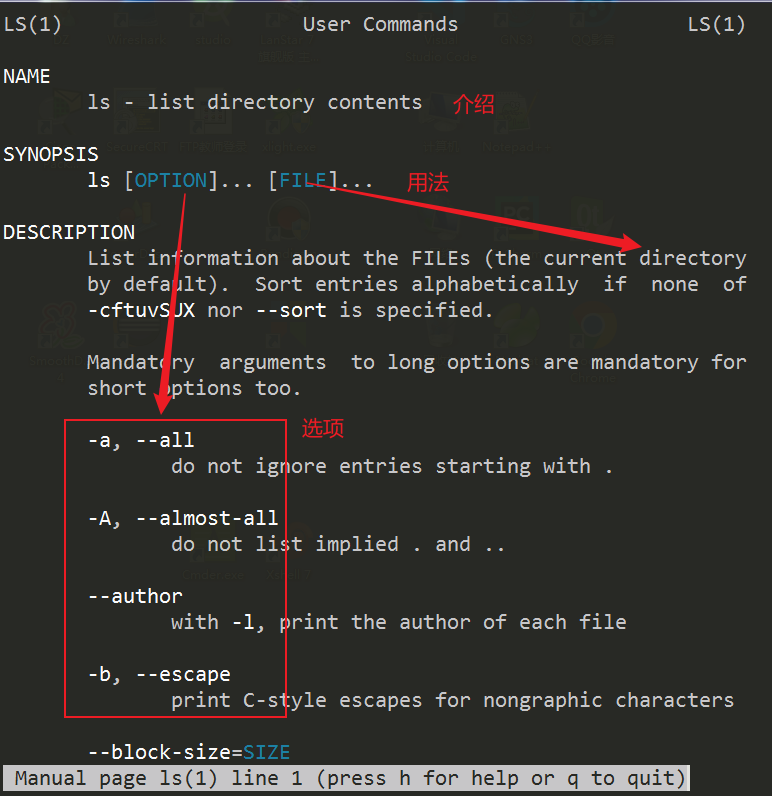
   - 空格翻页 
   - q退出手册 
4. whatis ls 查看某个命令大概的用途
5. man -k 根据用途的关键字 反向查找命令 
   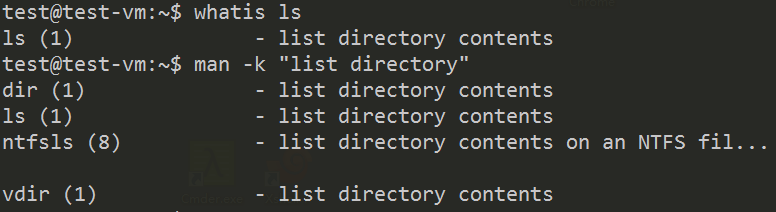
6. 命令 --help 查看某个命令的用法 
   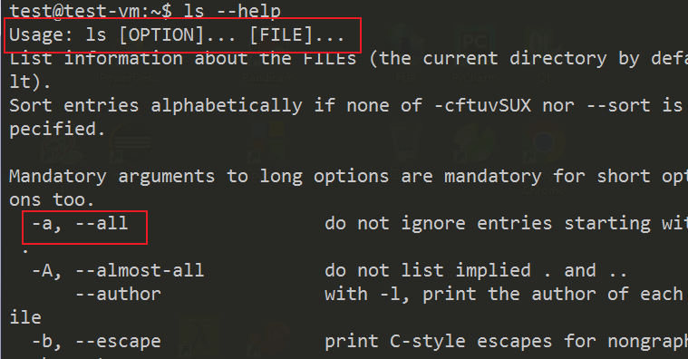
8. 更加简洁的 tldr (作业)
9. 查看命令的版本  --version 
   - ls --version 
   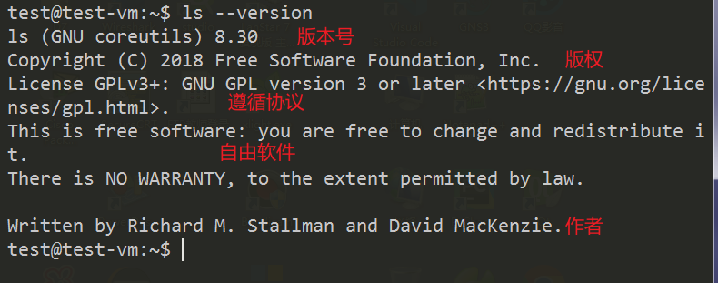

## 常用命令
1. 清空屏幕 clear   
2. 查看当前登录用户 who 
   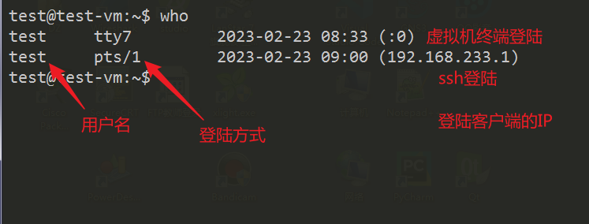
3. 时间，日期， date, cal 
4. 打印 echo 
5. 重启 sudo reboot 
6. 关闭 sudo shutdown -h now 
   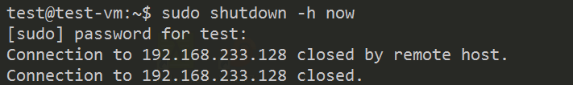

## 使用命令时的快捷键
1. 更加高效的在命令行内使用命令
2. 已经执行过的命令，再一次调出
   - ↑ 按一次，调出上一个命令
   - 按n次，调出上第n个命令
   - ↓ 调出下一个命令，如果下一个命令没有，就为空 
3. 隔得太久远的命令，按照关键字搜索
   - Ctrl + r  搜索，右键补全 
    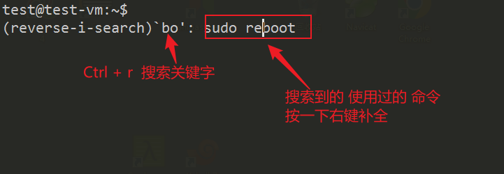
4. history 缓存之内所有历史命令
5. 清空屏幕 Ctrl + l 
6. Ctrl + a 光标到达命令的开头
7. Ctrl + e 光标到达命令的结尾 
8. Ctrl + ← 或者 Ctrl + → 光标 以一个单词为单位在命令移动 
9. Ctrl + c 
   - 另起一行，出现新的命令提示符$，
   - 终止已经运行起来的命令(进程)
   - 比如 top 死循环，类似win 任务管理器
10. Tab 补全命令 
    - 偷懒
    - 记不住太长命令
    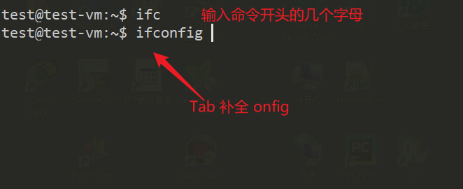
11. 快速两次Tab 
    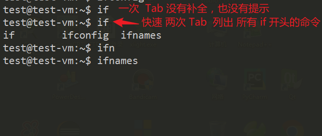
12. 补全路径
    - ls /h
    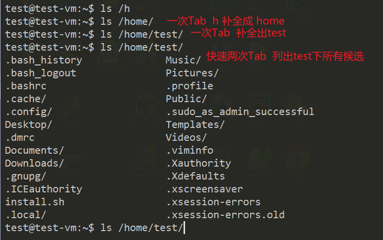
13. 在命令行输入命令时，养出多按Tab的习惯
14. 默认的shell 是 bash 
    - 更加高效 fish 