# lec-003

## review
1. 命令行操作
   - [sudo] 命令 [参数] [选项]
2. 陌生命令的帮助
   - man 命令
   - 命令 --help
   - tldr 命令 (举例子)
3. 常用的命令
   - clear
   - sudo reboot / sudo shutdown -h now
   - who  /  whoami
   - date / cal
   - echo
4. 命令行内使用的快捷键
   - ↑  ↓ 
   - Ctrl + r
   - Ctrl + l
   - Ctrl + c
   - Ctrl + a / Ctrl + e / Ctrl + ← / Ctrl + → 
   - Tab 

## Linux 用户管理

## 之前
1. 安装系统，设置用户和密码
2. tty/ssh登陆系统，使用用户和密码
3. sudo
4. who

## 多用户
1. 同时可以有多个用户来登陆操作系统
2. 用户的类型 
3. 超级用户 root 
   - 类似于Windows 下的 Administrator
   - 拥有最高的权限，格式化磁盘，安装软件，关闭重启系统，创建删除其他用户
   - 可以操作所有的目录
   - 家目录 /root
   - UID 0
4. 普通用户
   - 没有上述的权限
   - 只能操作自己的家目录
   - 家目录 /home/用户名
   - sudo 临时把普通用户的权限提升到root权限 / 输入普通用户的密码
   - 不是所有的普通用户都可以使用sudo
   - UID
5. 虚拟用户
   - UID，家目录
   - 不能登录系统，无法操作系统

## 用户管理
1. 增删改查用户，需要root权限
2. 用户身份切换

## 增加用户
1. useradd
   - sudo useradd hello 
    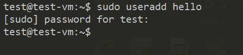
   - 创建出了用户，UID
   - 没有设置用户密码，没有创建家目录
   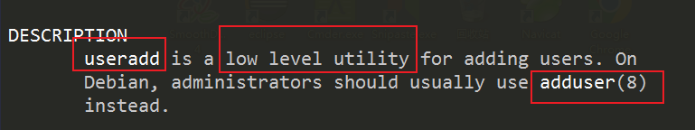
2. adduser
   - sudo adduser world / 1234 
   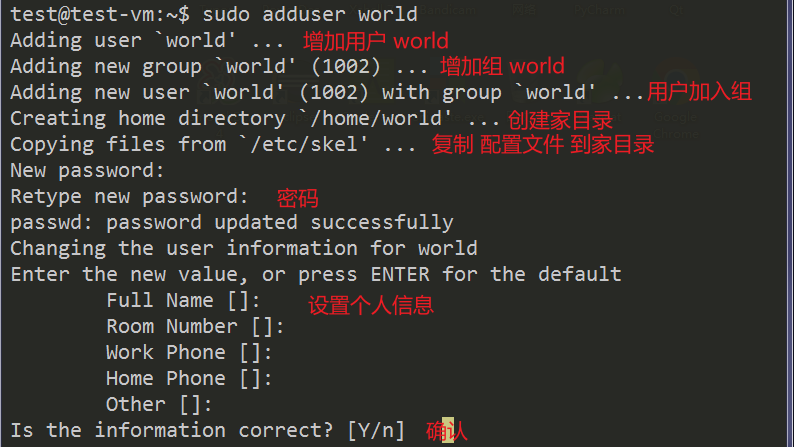
   - 创建同名的用户和组
   - 设置密码，可以登录
   - 创建了家目录
     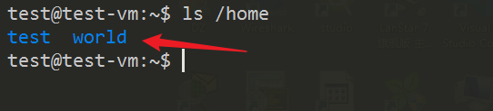
   - 复制了配置文件
     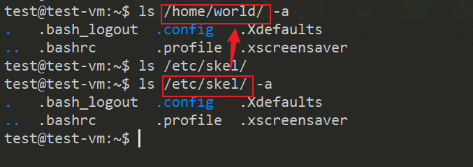
   - 可以ssh登录
     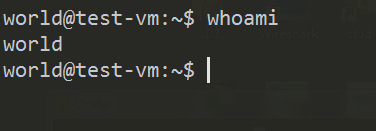

## 查看用户
1. 查看配置文件 /etc/passwd 
2. cat /etc/passwd 
   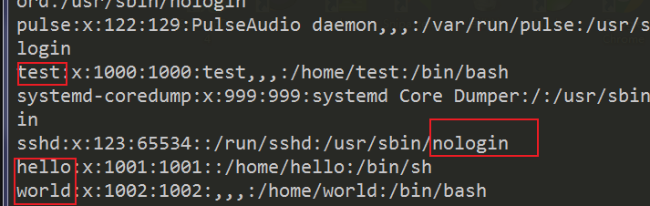
   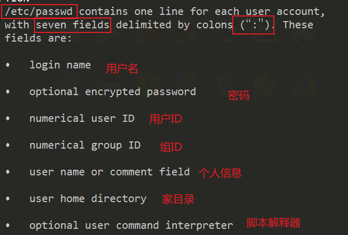

## man
1. man passwd 看到的是passwd 命令的手册
   - 等同于 man 1 passwd 
2. man 5 passwd 
   - 查看 /etc/passwd 文件 的手册
3. man man 
   - 9种类型的手册 
   - 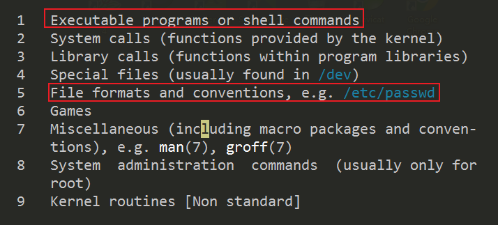

## 修改用户密码
1. sudo passwd world 
   - 1234 -> 4321 
   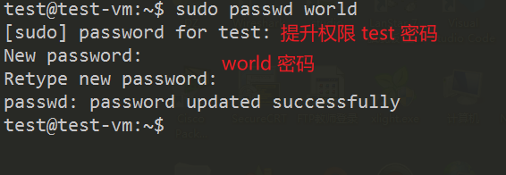
2. 设置root -> abcd 
   - sudo passwd 
   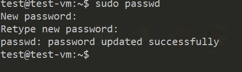

## 修改用户信息
1. usermod (modify)
2. 修改用户名  
   - sudo usermod -l hello666 hello
   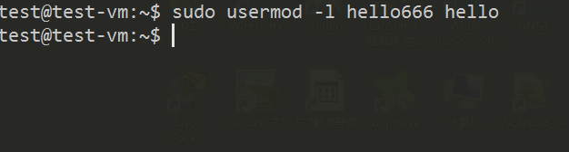
   - cat /etc/passwd 
   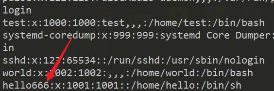
3. 给用户增加一个组 
   - sudo usermod -a -G hello world 
   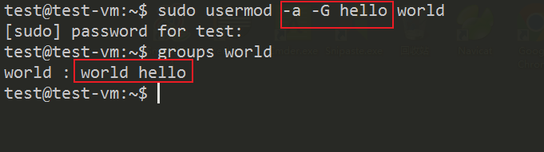

## 删除用户
1. ？

## 用户组
1. 为了管理同一组的用户，赋予同一种类型的权限
2. 一个组里可以有多个用户
3. 一个用户可以属于不同的组

## 用户组的管理
1. 增加 groupadd / addgroup
2. 删除 ？
3. 修改 groupmod
4. 查看 /etc/group

## 查看用户组
1. cat /etc/group 
   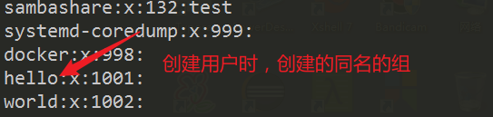
2. 查看用户属于哪些组 
   - groups world 
   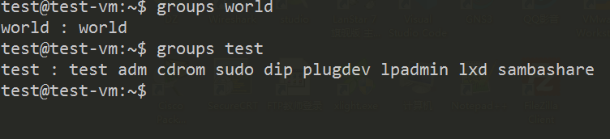
3. 在/etc/passwd 仅仅列出最主要的组的ID 
   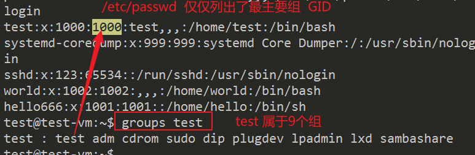

## 修改组
1. sudo groupmod -n hello999 hello
   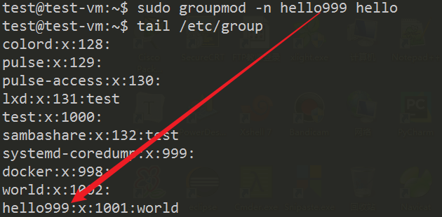

## 用户之间的切换
1. su 用户名
2. root / abcd
3. test / asdf
4. world / 4321
5. 当前用户test, 切换world 
   - su world 
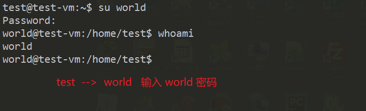
6. 退回test 
   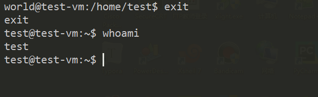
7. 当前是test, 切换到root 
   - su 
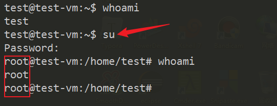
8. 当前是root, 切换到world 
   - su world 
   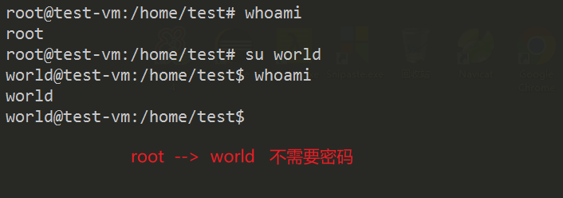

## 用户切换时的密码操作
1. 普通用户1 --> 普通用户2  需要普通用户2的密码
2. 普通用户 --> root  需要root密码
3. root --> 普通用户  不需要密码

## 总结 
1. 用户和组
2. 用户，root, 普通，虚拟
   - sudo 提权
3. 组，管理同一类型的用户
4. 用户操作
   - 增 adduser
   - 删 
   - 改 usermod 
   - 改密码 passwd 
   - 查 /etc/passwd; whoami; who 
   - 切换 su / exit
5. 组操作
   - 增 addgroup
   - 删 
   - 改 groupmod
   - 查 /etc/group; groups 
6. 配置文件
   - /etc/passwd
   - /etc/group
   - /etc/shadow
   - /etc/gshadow