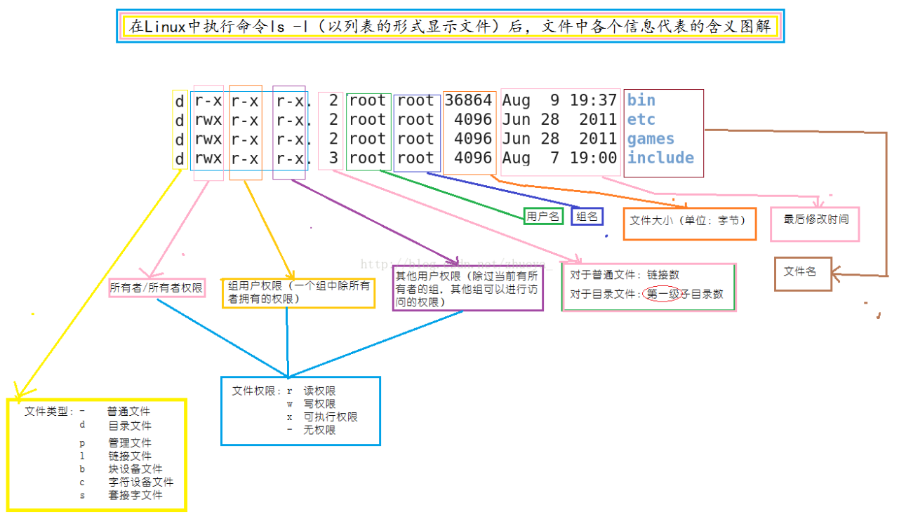

# lec-004

## review
1. 用户和组的管理
   - 权限相关
2. root, 普通用户(一部分用户可以sudo)，虚拟
3. 组，管理一些拥有相同权限的用户
4. 用户管理操作
   - 增 adduser
   - 删 deluser
   - 改 usermod, adduser
   - 查 /etc/passwd; who
   - 切换用户 su, 注意密码
5. 组管理操作
   - 增 addgroup
   - 删 delgroup
   - 改 groupmod
   - 查 /etc/group; groups
6. 配置文件
   - /etc/passwd 
   - /etc/shadow 
   - /etc/group
   - /etc/gshadow

## 文件系统和文件管理
1. 操作系统提供的一套软件和数据，用于管理操作文件

## 之前
1. nginx服务器
   - 主目录，/var/html/www
   - cp index.html /var/html/www
2. /root; /home/test
3. ls /home/test -al
4. /etc/xxxx

## 树状的目录结构
1. 从根目录开始  / 
   - 与windows不同，没有盘符，比如C盘
2. tree 查看树状结构
   - tree 目录 
   - tree /home/test
   
3. tree 查看当前目录的结构 
   
4. tree /home/test -L 1 控制目录深度
   
5. tree / 
   - Ctrl + C 停止
6. tree -L 1 / 
   

## 如何到达目录/如何在目录之间行走
1. 路径  /目录1/目录2/.../文件，和win类似 
2. 当前在什么目录
   - pwd 
   - $之前的目录提示
   
3. 特殊的目录符号
   - ~ 代表当前用户的家目录
   - / 根目录
   - \- 短横线代表 上一次所在的目录
   - . 当前目录
   - .. 上一层目录
4. 切换目录 cd
   - cd 目标目录 
5. 切换到根目录 cd /
   
6. 切换回上一次的目录  cd -
   
7. 上一层
   
8. 切换到家目录 
   
9. 切换目录的两种方式
   - 绝对路径，从根目录/开始
   - 相对路径，从当前所处位置开始
    - 向上，借助 .. 
    - 向下，借助 . 
10. 路径 
    
11. 向上两层
    

## 实际路径的切换 
1. 当前在家目录，/home/test, 达到 / 
   - 绝对， cd /
   - 相对,  cd ../../
2. 当前在根目录， 达到 /boot/grub 
   - 绝对,  cd /boot/grub
   - 相对， cd boot/grub 或者 cd ./boot/grub
3. 当前在/boot/grub, 到达 /dev/block 
   - 绝对， cd /dev/block 
   - 相对,  cd ../../dev/block
   
4. 树状展开 
   
5. 分解开来，一个目录操作
   
6. 从 /usr/lib/blueman  进入  /usr/lib/apparmor 
   

## 使用行对路径常犯的错误
1. 往上走，数错层，../../../
2. 往下走，认为多加一个 / 
   - / 如果放在最前面，一定代表根目录
   - ./ 和 . 都是代表当前目录，都可以忽略
   - ../ 和 .. 都可以上一层 
3. 当前在 /var， 进入 /var/local 
   - cd local
   - cd ./local
   - cd ../var/local
   - cd /local 人为加了一个/   错的

## 使用路径的技巧
1. Tab补全目录 
2. 合理选择相对或者绝对，选择最快的；可以分解，单个目录操作
3. 路径，并不仅仅用于cd ，还可以用于 复制，删除，移动 等文件操作 

## 查看文件的信息
1. ls -l 
   
2. ls -lh 
   
3. 文件详细信息
   