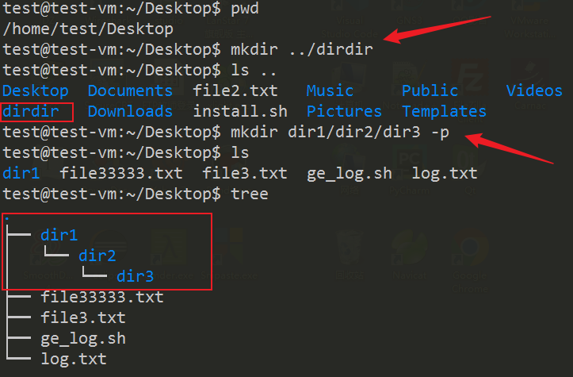

# lec-005

## review 
1. 文件系统
   - 树状目录结构，tree
   - 切换目录 cd 路径
   - pwd 查看当前位置
   - 路径 /目录/目录/.....
   - 绝对路径 /
   - 相对路径
     - ./ 向下 (可以是 ./目录，或者 目录;  绝对不是  /目录)
     - ../ 向上  (数对层数，Tab补全)
2. 特殊符号
   - / 根目录
   - ~ 当前用户的家目录
   - \- 上一次
   - . 当前
   - .. 上一层 
3. 文件的详细信息
   - ls -lh 
   - drw--wx--x 3 test zsc 10K  Aug 22 2022 filename 

## 文件的操作
1. 新建，删除，复制，移动， 修改， 查看
2. 注意结合： 绝对路径和相对路径
3. 文件和目录的操作有一些差异

## 具体的文件操作
1. 新建文件
   - touch 路径/文件名
   - 修改已存在的文件的 最后修改时间
   
2. 删除文件
   - rm 路径/文件名
   - remove 
   
3. 复制文件
   - cp 源文件 目标文件
   - copy 
   
4. 移动文件(rename)
   - mv 源文件 目标文件
   - move
   
5. 查看
   - ls -l 查看文件外部信息

## 查看文件内容
1. cat 打印文件的全部内容 
2. 分屏查看，只看一部分内容 more / less 
   - 跟man手册的查看方式一样
   
3. head 查看开头的内容 / tail 查看结尾的内容
   
4. 监视文件内容的变化 tail -f 
   

## 目录的操作
1. 查看目录  
   - pwd  /  ls  /  tree 
2. 切换目录
   - cd 
3. 新建目录 mkdir 
   - 多级 mkdir -p 
   
4. 复制目录 cp -r 
   - recursive 
   
5. 移动目录 mv 
   
6. 删除目录 rm -r
   

## 链接文件
1. 硬链接
   - 利用文件的索引节点进行链接
   - 索引节点可以认为是文件的唯一ID号，其存储了文件信息
   - 系统通过索引节点来定位文件 
   - 根据源文件创建的硬链接文件，索引节点相同，大小相同，都指向同一个数据块
   - 删除一个硬链接，文件数据块依然存在，直到所有的硬链接都被删除，真正的数据块才被最终删除

2. 软链接(符号链接)
   - 存储源文件的路径信息
   - 源文件和软链接文件的索引节点不同，大小不同
   - 删除或者移动软链接，不影响源文件
   - 删除或者移动源文件，会影响软链接

3. ln 源文件 链接文件 -s 
   
4. ls -il 查看索引节点
   

## 相对路径创建软链接
1. ln -s 源文件 链接文件
2. 源文件的相对路径，相对最终的链接文件所在位置，因为链接文件存储的就是源文件的路径
3. 链接文件的相对路径，相对当前所在位置 