# lec-006

## review
1. 命令的基本格式，快捷键
2. 用户管理
3. 文件系统
4. 文件操作
   - 结合相对路径，绝对路径
   - 增 touch / mkdir -p
   - 删 rm / rm -r 
   - 改 mv(rename)
   - 查 cat  more  less   head  tail  /  ls   tree   pwd  
   - 复制 cp  /  cp -r 
   - 移动 mv 
5. 链接文件
   - 硬链接 存储文件的索引节点
   - 软链接 (符号链接)存储文件的路径
   - ln  源文件  链接文件  -s

## 软链接和硬链接
1. 软链接
   - 可以给目录或者文件建立软链接
   - 可以在不同目录下给源文件建立软链接
   - 删除或者移动源文件，软链接失效
   - 删除软链接，源文件不受影响
   - 类似win下的快捷方式
   - 使用场景：无需复制源文件，可以在不同目录下方便的访问源文件
2. 硬链接
   - 不能给目录建立硬链接
   - 可以在不同目录下给源文件建立硬链接
   - 删除或者移动源文件，硬链接不受影响
   - 删除或者移动硬链接，源文件不受影响
   - 把所有的硬链接和源文件全部删除，原始的数据块才被删除
   - win下没有硬链接
   - 使用场景：备份重要文件，把源文件和硬链接放在不同目录，防止源文件被误删除

|          | 源文件     | 复制文件     | 硬链接   | 软链接    |
| -------- | ---------- | ------------ | -------- | --------- |
| 数据块   | AAA        | BBB          | AAA      | AAA / CCC |
| 索引节点 | 432        | 433          | 432      | 434       |
| 文件名   | src        | cp_src / src | h_src    | s_src     |
| 文件大小 | 30M        | 30M          | 30M      | 8bytes    |
| 有效性   | 删除或移动 | 不受影响     | 不受影响 | 失效      |

## 文件信息的修改
-rw-rw-r-- 1 test test 0 3月  23 09:08 file

1. file 文件名
   - mv 源文件名 新文件名 
2. 3月  23 09:08 最后的修改时间
   - touch 文件名
   - 用编辑器编辑内容
   - 写入数据 echo "hello" > 源文件 
3. 0 文件大小 单位bytes 
   - 用编辑器编辑内容
   - 写入数据 echo "hello" > 源文件 
   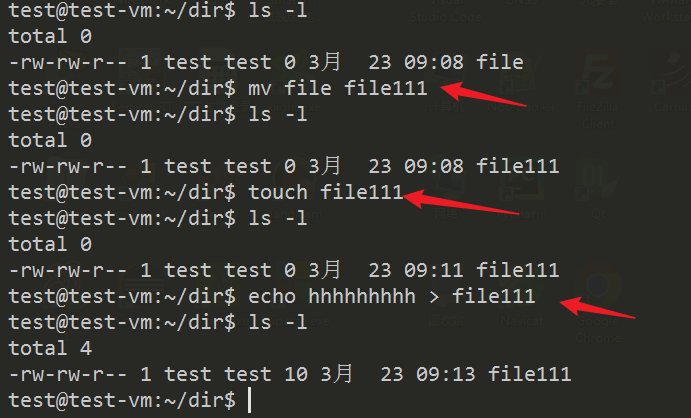
4. test 文件所属组
   - chgrp change group ownership
   - sudo chgrp 组名 文件名 
   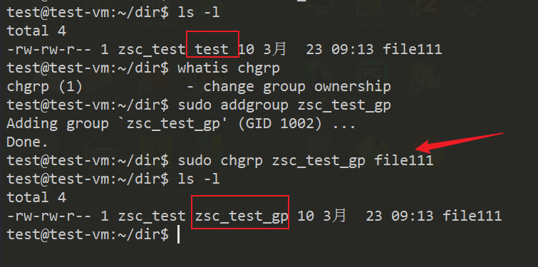
5. test 文件所属用户
   - chown   change file owner and group
   - sudo chown  用户名  文件名
   - sudo chown  用户名:组名  文件名
   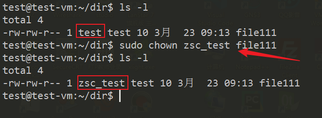
6. 1 普通文件 硬链接的数量 
   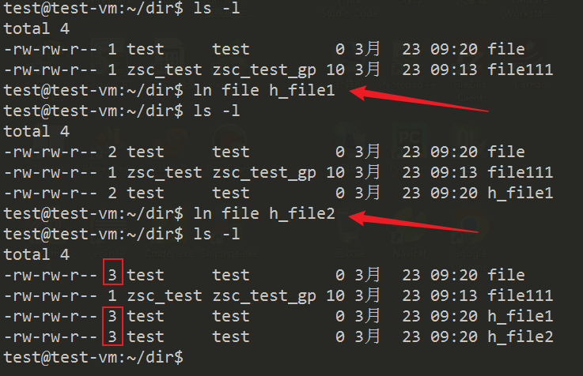
7. 目录 第一层子目录的数量 
   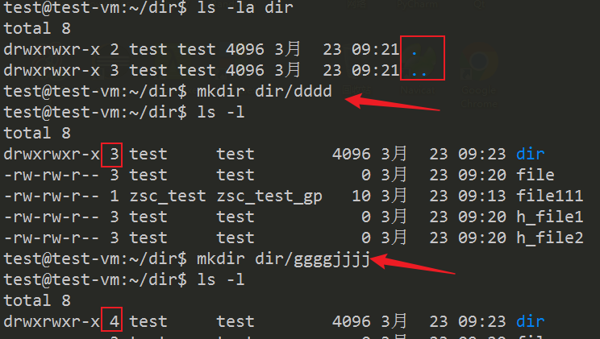

## 文件权限的修改
1. rw-rw-r--
   - 三组权限，user, group, others 
   - chmod   change file mode bits
   - chmod  新的权限  文件名 
2. chmod 两种方式修改文件权限
   - 字母的方式
   - 数字的方式
3. 字母的方式
   - u 代表 user  文件所属用户
   - g 代表 group 文件所属组
   - o 代表 others 其它组的用户
   - a 代表 all = u + g + o (默认，可忽略)
   - 权限的表示就是，r 读, w 写, x 执行 
   - 增加 + 
   - 减少 - 
   - 设定 = 
   - chmod u+x file 
   - chmod g-w file
   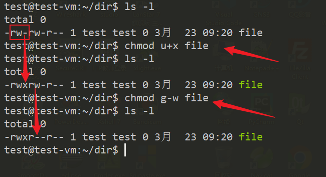
   - chmod u=rw,g=x,o=w file
   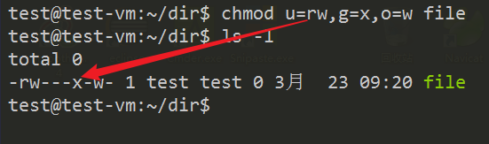
   - chmod a=wx file 
   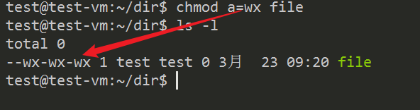
   - chmod +r file 
   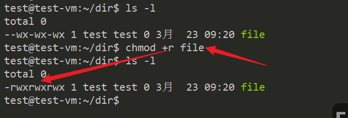
4. 数字的方式
   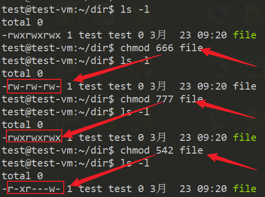

| 权限 | 二进制 | 八进制              |
| ---- | ------ | ------------------- |
| rwx  | 111    | 7 = 2^2 + 2^1 + 2^0 |
| rw-  | 110    | 6                   |
| r-x  | 101    | 5                   |
| r--  | 100    | 4                   |
| -wx  | 011    | 3                   |
| -w-  | 010    | 2                   |
| --x  | 001    | 1                   |
| ---  | 000    | 0                   |

## 通配符
1. 由shell提供的一种规则，用于匹配文件名，大部分涉及文件的命令都可以使用
2. ? 匹配任意一个字符
   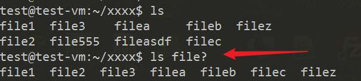
3. \* 匹配任意多个任意的字符
   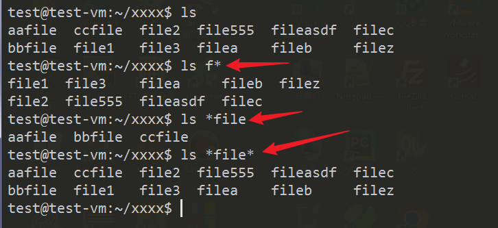
4. [acz] 匹配acz三个字符里的任意一个字符
5. [a-z] 匹配任意一个字母
6. [0-9] 匹配任意一个数字
   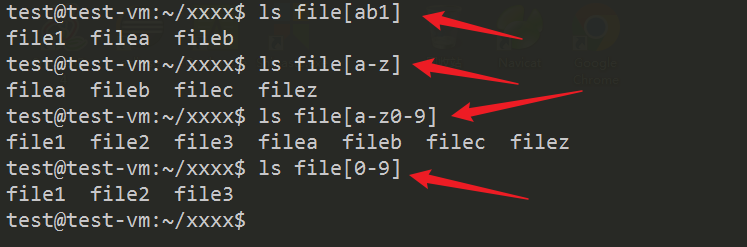
7. 生成序列
8. {a,c,f}
9. {0..9}
10. {a..z}
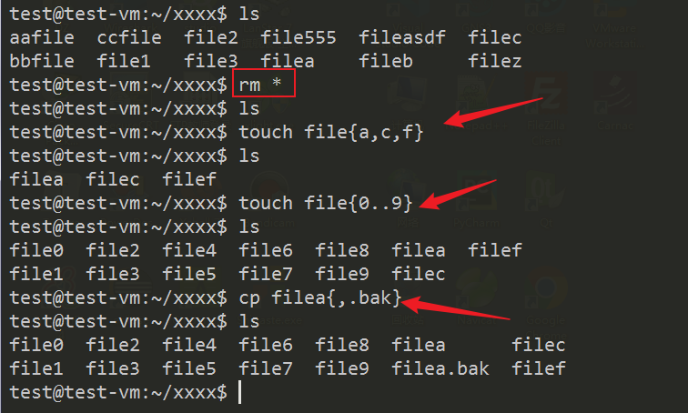
   