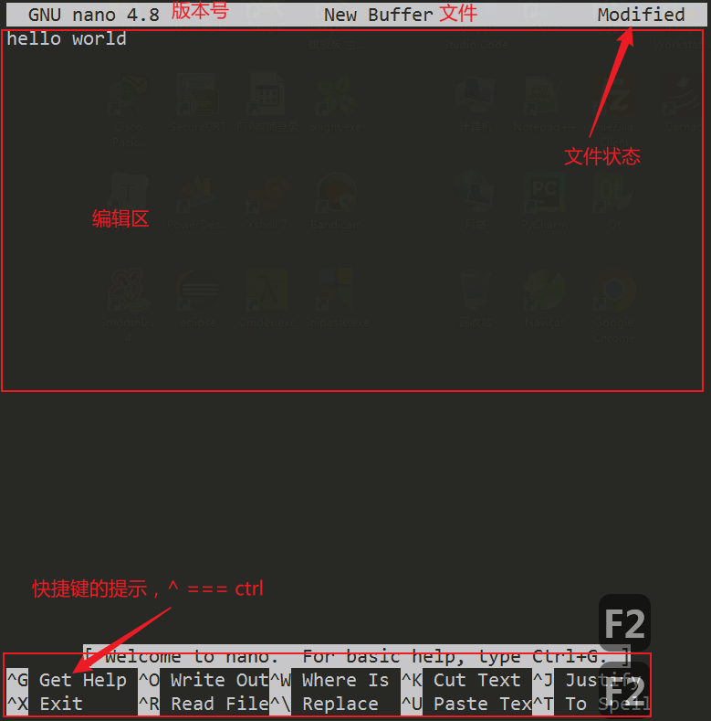
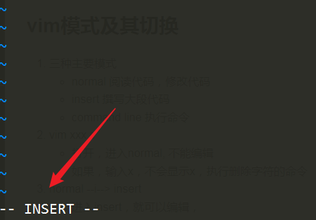
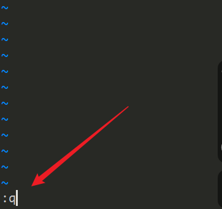
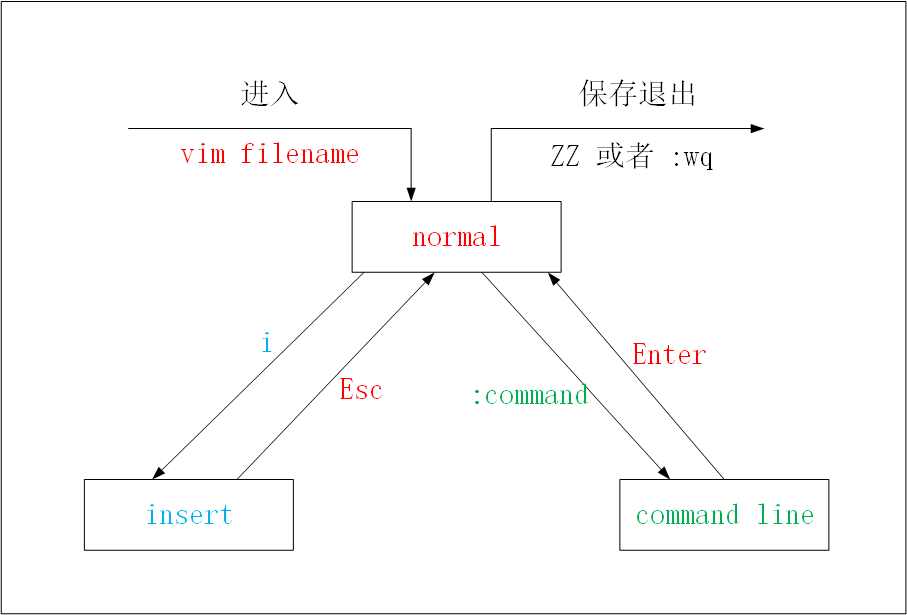
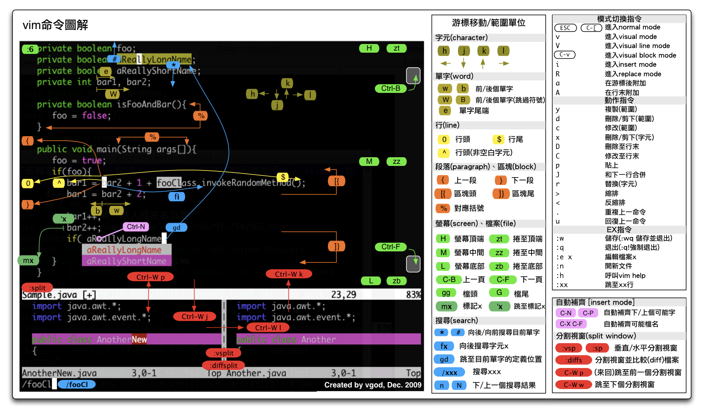

# lec-007

## review
1. 软连接与硬链接
2. 文件属性的修改
   - -rwxrw-rw- 1 test test 7677 3月  27 08:15 Snake.cpp
   - 权限 chmod [augo][+-=]r,w,x / 777 / 543 
   - 硬链接数量 / 第一层子目录数量 ln / mkdir rm
   - 所属用户 sudo chown 新用户:新组 文件名
   - 所属组 sudo chgrp 新组 文件名
   - 文件大小  编辑 / echo 
   - 修改时间  touch / 编辑 / echo 
   - 文件名 mv(rename)
3. 通配符
   - ? 任意一次
   - \* 任意多次
   - [arg] / [a-z0-9] 括号内任意一次
   - 生成序列 {a,f,7,8} / {a..z} 

## 编辑器
1. 命令行下的文本编辑器 
2. nano
3. vim

## nano
1. 符合通常的使用习惯，打开即可编辑
   
2. ctrl + o 保存 
3. ctrl + x 退出

## nano 配置文件
1. 用于定制nano的行为 
2. /etc/nanorc  全局，作用到所有用户
3. ~/.nanorc 局部，当前用户

## nano显示行号
1. 修改配置文件 ~/.nanorc
2. man nanorc 查看手册
3. 加入以下内容  set linenumbers 

## vim
1. 适合于编程的任务，因为编程大部分时间是在读代码，对代码做小范围的修改，仅仅小部分时间在撰写大段的代码；vim通过模式来实现
2. 为了高效，摈弃鼠标，所有，文本编辑，修改，移动光标，保存等操作，都有键盘来完成
3. 可以把vim当做一个编程语言来使用，通过组合快捷键来达到想要的效果
4. 各种流行的编辑器都可以安装vim插件，包括 vscode， jupyter

## vim模式及其切换
1. 三种主要模式
   - normal 阅读代码，修改代码
   - insert 撰写大段代码
   - command line 执行命令
2. vim xxx.c 
   - 打开，进入normal, 不能编辑
   - 如果，输入x，不会显示x，执行删除字符的命令
3. normal --i--> insert
   - 进入insert，就可以编辑，
   
4. insert --esc--> normal 
5. normal --:--> command line 
   - 光标跳到左下角
   - :w + Enter 保存 
   - :q  退出
   - :wq 保存 + 退出 
   - :q! 不保存，强制退出
   - 可以用上下键调出上次使用的命令
   
6. 三种模式的切换
   

## 初学者
1. vim 打开文档 
2. i 进入 insert 
3. esc 退回 normal 
4. :wq 保存退出

## vim显示行号
1. 临时显示行号
   - :set nu 显示行号
   - :set nonu 隐藏行号
2. 修改配置文件，永久显示行号
   - 修改 ~/.vimrc
   - 加入以下内容 set nu 


## 进一步学习vim 


## 快捷键的图示 


## 获得帮助
1. :help w 
2. :help :w 
3. 退出帮助页面 :q 

## 运行shell命令 
1. :! ls /home/test 
2. Enter 返回vim 

---

## 光标的位置移动 
1. 最基本的，移动一个字符
   - h 左，j 下，k 上，l 右
2. 移动一个单词的长度
   - w, word 正向移动到下一个单词开头
   - b, backward 反向 
   - e, end 正向移动到下一个单词的结尾 
3. 行内移动光标 
   - 0 行首  
   - ^ 行首 非空字符 
   - $ 行尾  
5. 行内查找字符移动光标 
   - f, find 正向查找 
     - fw 正向查找字符w 
   - F  反向 
6. 篇章移动光标 
   - gg 篇章开头 
   - G  篇章结尾 
7. 光标到达指定的行 
   - 10G  到达第10行
   - :10 
8. 光标位置的记录
   - ctrl + o 上一次光标所在位置
   - ctrl + i 下一次光标所在位置 
   - 类似于shell中上下键调出命令  
9.  滚动屏幕 
   - ctrl + b, backward 向上移动一页 
   - ctrl + f, forward 向下移动一页
   - ctrl + u, up   向上滚动半页
   - ctrl + d, down 向下滚动半页


## 搜索 
1. /word 向前搜索关键字 word 
2. ?word 向后搜索关键字 word 
3. 注意左下角有提示 
4. n 搜索下一个关键字 
5. N 上一个 

---

## 编辑 
1. 进入insert 
   - i 在当前光标位置 进入 insert 模式 
   - I 行首位置 
   - a 在当前光标位置后一个字符
   - A 行尾位置
   - o 在当前光标位置 下一行，新开一行
   - O 在当前光标位置 上一行，新开一行

## 撤销恢复 
1. u, undo  撤销上一步操作
2. ctrl-r, redo  恢复上一步操作 

---


## 删除 
1. 删除字符 
   - x 向后删除一个字符
   - X 向前删除一个字符，相当于 Backspace 
2. 删除(剪切)一个单词 
   - dw, delete world 
3. 删除(剪切)光标所在一行 
   - dd 
4. 删除(剪切)光标到所在行行尾 
   - d$ 
   - D 
5. 删除(剪切)光标到所在行行首 
   - d0 
6. 删除(剪切)光标到篇章的结尾
   - dG  
7. 删除(剪切)光标到篇章的开头
   - d1G 
8. 删除括号内容 
   - 三种括号，(), [], {} 
   - di(, inside, 删除括号内部内容，不包含括号 
   - da(, around, 包含括号  

---

## 复制剪切粘贴 
1. 复制 y, yank
2. 复制一个单词 
   - yw  
3. 粘贴 
   - p, paste 在光标之后或者下一行粘贴
   - P 在光标之前或者上一行粘贴
4. 复制光标所在行 
   - yy / Y 
5. 复制光标到所在行结尾 
   - y$ 
6. 复制光标到所在行开头 
   - y0 
7. 复制光标到篇章结尾 
   - yG 
8.  复制光标到篇章开头
   - y1G 
9.  复制括号内容 
   - yi(, inside, 删除括号内部内容，不包含括号 
   - ya(, around, 包含括号  
10. J 合并两行，当前行与下一行 
11. 剪切粘贴 
   - 上述删除命令都是剪切 

---

## 替换修改 
1. 替换一个字符 
   - r, replace 
   - normal -> insert -> normal 替换完毕自动返回到normal  
2. 替换所有
   - R, 进入replace模式
   - 替换完毕，手动返回normal 
3. 修改一个单词 
   - cw, change word 
   - cw = dw + i  
   - 修改完毕，手动返回normal 
4. 修改光标所在行   
   - cc
5. 修改光标到所在行结尾
   - c$ 
   - C 
6. 修改光标到所在行开头 
   - c0 
7. 修改光标到篇章结尾 
   - cG 
8. 修改光标到篇章开头
   - c1G 
9.  修改括号内的内容  
   - 三种括号，(), [], {} 
   - ci(, inside, 修改括号内部内容，不包含括号 
   - ca(, around, 包含括号

---

## 删除复制修改
1. 都可以和光标位置结合使用 
2. 比如 $, 0, ^, G, 
3. 其实也可以和 hjkl结合使用 
   - dl 删除光标右侧一个字符
   - yl 复制光标右侧一个字符  


## 关键词搜索替换 
1. command line 模式 
2. `:s/word1/word2`  光标所在行搜索第一个word1，并替换为word2 
3. `:s/word1/word2/g`  光标所在行搜索所有word1，并全部替换为word2 
4. `:n1,n2s/word1/word2/g`	n1与n2行之间搜索所有word1，并全部替换为word2
5. `:1,$s/word1/word2/g`     全文搜索所有word1，并全部替换为word2   
6. 或者 `:%s/word1/word2/g`	  

---

## 选择文本 
1. v 进入visual模式 
2. V 进入visual line模式 
3. ctrl + v 进入visual block模式 
4. 通过移动光标选择 
5. 选择之后，
   - Esc退回normal 
   - 可以复制y，可以粘贴p
   - 可以删除(剪切)d，可以粘贴p
   - 可以修改c
   - 可以替换r

---

## 重复上一个操作 
一个点 . 


## count 加持 
1. 大部分操作都可以用count加持 
2. 4j 光标向下移动4行 
3. 4G 光标移动到第4行 
4. 10x 删除后面10个字符 
5. 7dw 删除7个单词 
6. 3dd 删除3行 
7. 5yy 复制5行


## 实际上至少五种模式 
1. normal 
2. insert 
3. replace 
4. visual 
5. command line 

---

## 多窗口  
1. sp, split 上下窗口，横向 
2. vsp, vsplit 左右窗口，竖向 
3. 切换窗口 
   - ctrl + w 两次 
   - ctrl + w + hjkl 
4. 关闭窗口 :q 
5. 不过，每个文件可以对应多个窗口

---


## 录制宏  
1. 记录规律性的多步操作，后续可以重复使用
2. normal模式，q 开始录制 
3. [0-9a-z] 指定录制的缓存器，注意左下角的提示
4. 进行一系列的操作，如果稍后要对多行操作，记得换行
5. 退回到normal模式，q 结束录制 
6. @[0-9a-z] 运行缓存器[0-9a-z]指定的宏
7. count加持 
   - 8@[0-9a-z] 运行宏8次

```shell 
# 行注释 
qa          # 录制以下动作到寄存器a 
0           # 光标移动到行首 
i           # 进入insert    
//          # 输入//，注释本行 
esc         # 返回normal 
j           # 光标移动到下一行 
q           # 停止录制 

10@a        # 执行宏，注释10行 
```

---

## 递增递减
1. 对数值类型的值有效 
2. ctrl + a 递增，针对光标之后的第一个数值  
3. ctrl + x 递减 
4. count加持 
   - 3ctrl + a 增加3 
5. 选择加持 
   - V 选择多行 

## 递增序列 
1. 宏 + 递增 
```shell
# 移动光标到某一个空行 
yy            # 复制空行  
10p           # 制造10个空行 

i             # 进入normal
1             # 输入数字1
ESC           # 返回normal 

qa            # 录制以下动作到寄存器a 
0             # 行首
yy            # 复制一行
p             # 粘贴到下一行
ctrl+a        # 数字递增  
q             # 停止录制 

10@a          # 执行宏10次 
```


## vim光标位置操作示意图


---

## 深入学习
1. [vim菜鸟教程常用快捷键](https://www.runoob.com/linux/linux-vim.html)
2. [vi-hot-key](https://lhammer.cn/2017/08/12/vi-hot-key/)
3. vim教程，可以很好的学习vim用法 vimtutor  
4. [游戏PacVim](https://gitee.com/mirrors/PacVim)