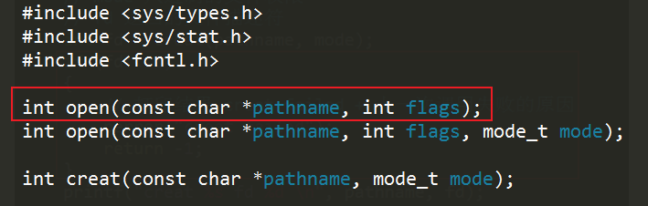

# lec-008

## review
1. vim
2. 快捷键
   - 光标移动  hjkl, w, 0, $, g, 1G
   - 编辑 i / a / o
   - 删除 x, d
   - 替换 r
   - 复制剪切粘贴 y, p
   - 修改 c
   - 撤销恢复 u / ctrl + r 
   - 关键字搜索  /key
   - 关键字替换  %s/w1/w2/g
   - 选择内容 v 
   - 多窗口 sp / vsp 
   - 数字加持  10dw
   - 录制宏  qa  q  10@a
3. vimtutor / pacvim

## IO系统调用
1. input-ouput
2. 主要针对文件IO 
3. 系统调用，操作系统提供的一些c语言的函数
4. IO系统调用，主要用于操作文件
   - creat
   - open
   - close
   - read 
   - write 

## 几个概念 
1. pathname 文件路径 
2. mode 文件权限
3. flags 文件打开方式
4. file -> file descriptor  文件描述符 
5. offset 文件游标
6. buffer 缓存 
7. count 读写长度 

## creat 
1. man 2 creat
   
   
   
2. 代码 
   
3. 编译执行
   

## 创建文件失败
1. 用错误的路径，模拟 失败的情况
2. cp creat.c  creat_error.c 
3. 代码 
   
4. 编译执行结果，返回-1 
   - 没有创建 dir/new_file 
   
5. perror 打印上一次 失败的原因 
   - man 3 perror 
   
6. 代码 
   
7. 编译执行，提示文件路径不存在
   

## open close 
1. man 2 open  
   
   
2. man 2 close
   
3. cp creat_error.c open_close.c 
4. 代码
   
5. 执行 
   

## read 
1. man 2 read 
   
   
2. man 3 memset 初始化缓存 
   
3. cp open_close.c read.c 
4. 代码 
   
   
5. 执行结果
   

## write 
1. man 2 write 
   
   
2. man 3 strlen 
   
3. cp read.c read_write.c 
4. 代码
   
5. 执行结果
   