# lec-009

## review
1. IO系统调用
   - creat
   - open
   - close
   - read
   - write
2. 文件描述符 fd 
3. offset  read 和 write 
4. 细节
   - mode  0664
   - flags  O_RDONLY | O_CREAT
   - void*  
   - size_t  mode_t
   - gcc creat.c -o creat 
   - ./creat

## 小问题 
1. ls  /  mkdir  / chmod  不需要指定路径 
2. ./creat  /  /home/test/src/creat  编译出来的可执行文件，需要指定路径，才能执行
3. 编译时没有指定头文件的路径

## 环境变量
1. 变量  作用域是当前shell 
   - number=123, 声明和赋值，等号前后不能有空格
   - echo $number
   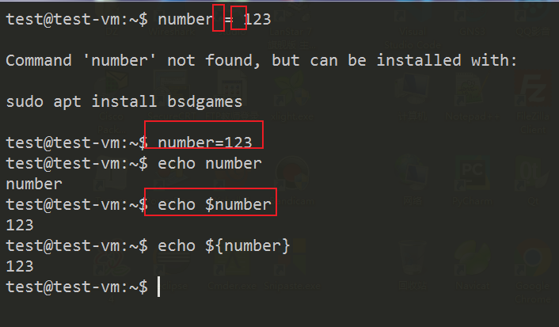
2. bash 进入 子shell，变量失效
   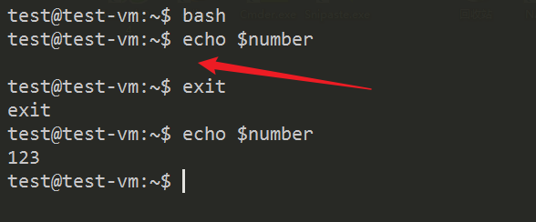
3. 环境变量  作用域包括子shell 
   - 在父shell声明的环境变量，在子shell依然有效
   - export NUMBER=321
   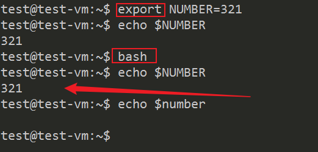
4. 子shell声明的变量，退回到父shell失效
   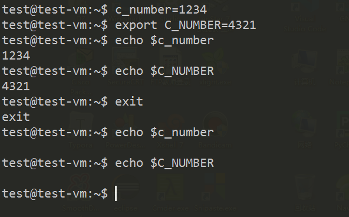
5. 关闭shell, 退回到win 
   - 再次连接linux, 变量和环境变量都失效

## 永久有效的变量
1. 在配置文件中声明
2. 只要保证配置文件在以下时机会被自动加载
   - 登陆系统
   - ssh 连接
   - 打开shell
3. 系统级 /etc/bash.bashrc
4. 用户级 ~/.bashrc
5. 通常只修改当前用户的配置文件
   - 注意，修改之前做一个备份
   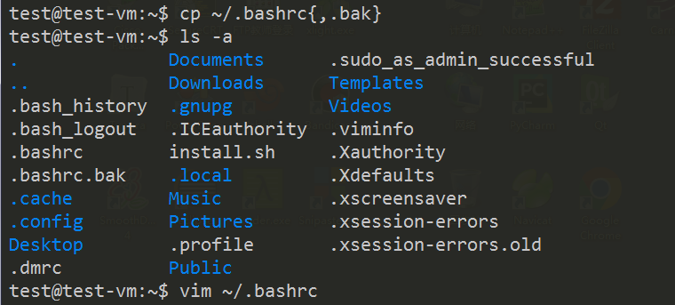
   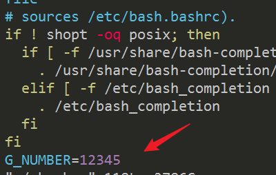
6. 手动加载配置文件  source ~/.bashrc 
7. 退出重新登陆，或者进入子shell, 配置文件会被自动加载
   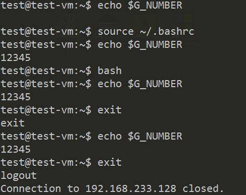
   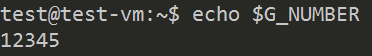

## 常用的环境变量
1. PWD 
2. HOME
3. PATH 
   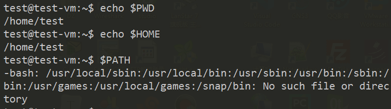
4. bin 路径 包含，命令，程序，第三方程序
   - 自己写的代码，编译可执行文件所在路径，没有被包含在PATH
   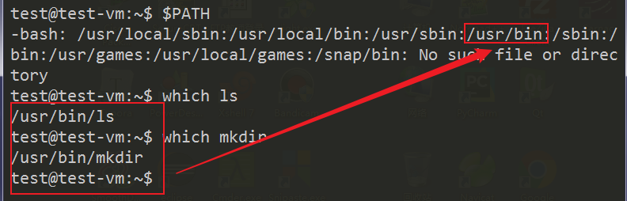
5. 执行自己编译的可执行文件 creat 
   - ./creat  /  /home/test/xxx/creat 
   - creat 失败
   - 如果要直接执行creat 
   - 把creat所在路径，加入PATH 
   - 或者，在PATH指定的某个路径下创建一个软链接指向实际的creat 
6. C_INCLUDE 

## 文件搜索
1. which 只能搜索PATH路径下的可执行文件
2. find 搜索任意的范围，多个条件叠加搜索，搜索结果可以做进一步的批量处理

## find 
1. find [何处]  何物(多个条件叠加)  [处理]
   - 不指定何处，默认搜索当前目录
   - 默认 自动递归到子目录中
2. 按照文件名字搜索
   - find  /usr   -name  "stat.h"
   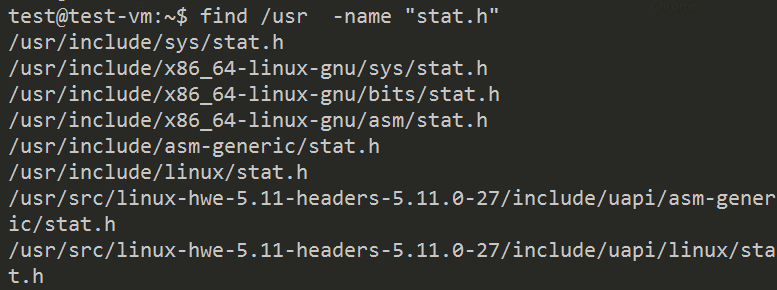
3. 控制搜索目录深度 
   - find  /usr  -maxdepth 3 -name  "stat.h"
   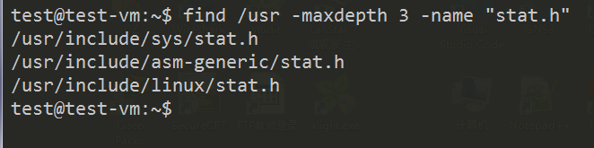
4. 结合通配符
   - find  /etc   -name  "*.conf"
   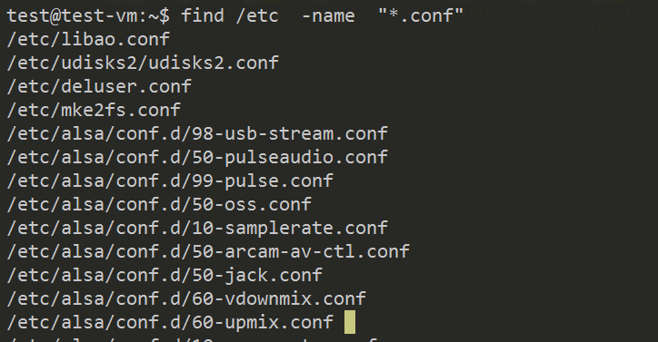

## 按照文件大小搜索
1. -size  +10M  大于10M 
2. -size  -10k  小于10k 
3. -size  3G    等于3G 
4. -size +5k  -size -20k   大于5k, 小于20k
5. find  /usr  -maxdepth 3 -name  "stat.h"  -size  +5k 
  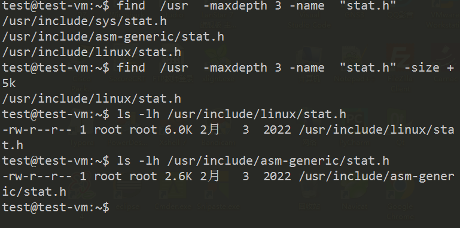

## 按照时间搜索
1. 按天 -ctime -mtime
2. 按分钟 -cmin -mmin 
3. -cmin -6  6分钟之内创建的文件

## 文件类型
1. -type 
2. -type b 搜索 block 文件
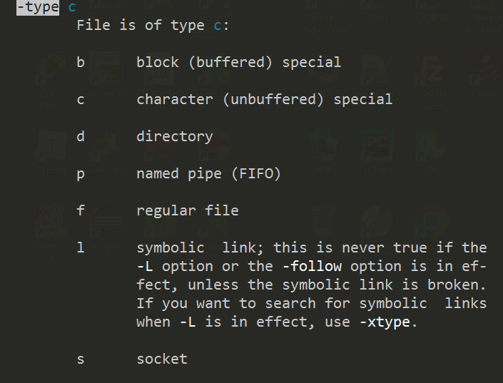

## 其他一些属性作为搜索条件
1. 权限  -perm  664
2. 用户  -user  root 
3. 组    -group test

## 搜索结果的处理
1. 列出搜索结果的详细信息 
   - find  /usr  -maxdepth 3 -name  "stat.h" -ls
   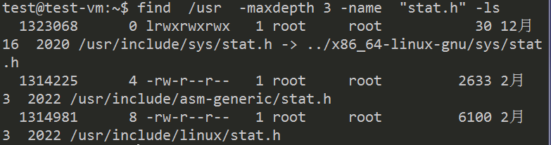
2. 格式化的信息输出
   - find  /usr  -maxdepth 3 -name  "stat.h"  -printf "%p --- %u \n" 
   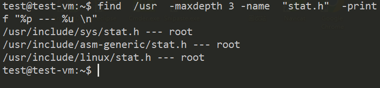
3. 删除结果 -delete 
   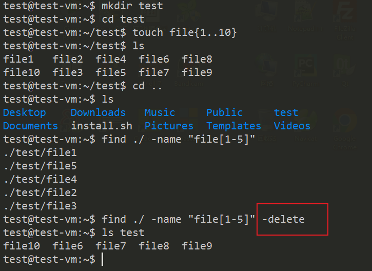

## 配合其它文件操作命令一起使用
1. cp / mv / chmod  /  rm
2. -exec 直接执行后面操作 
3. `find  ./   -name  "file*" -exec chmod 777  {}  \;`
   - {} 占位符，填充每个搜索到的结果
   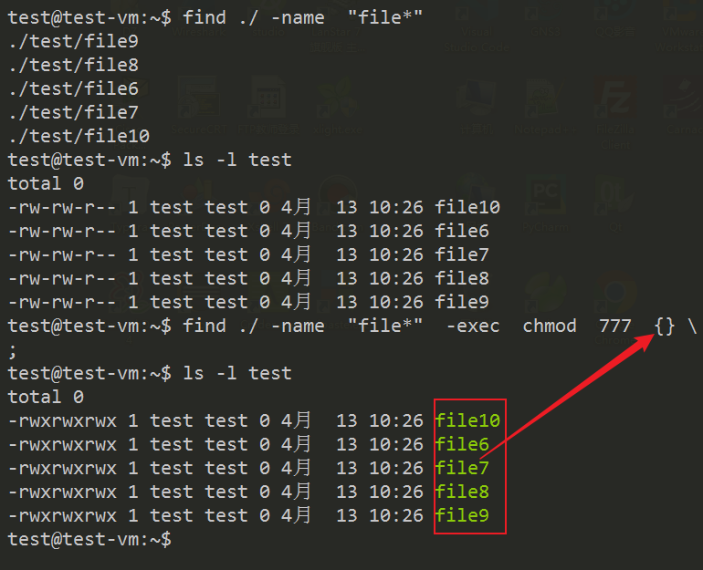
4. -ok  确认每次搜索的结果是否要执行后续操作
   - y 确定， n 否定 
   - `find  ./   -name  "file*" -ok chmod 666  {}  \;`
   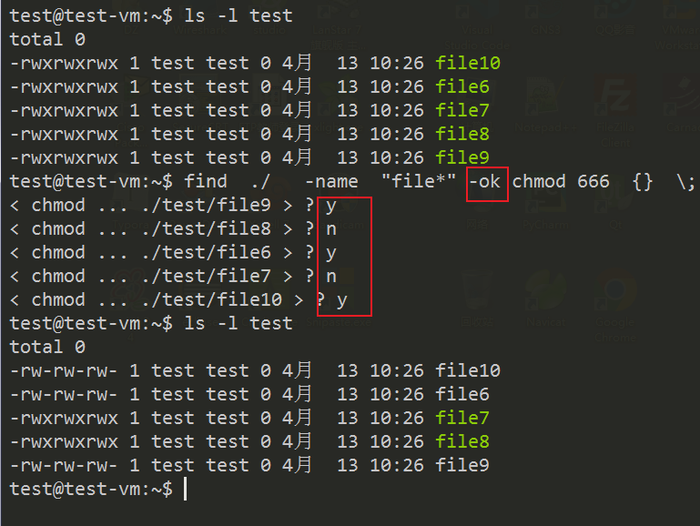