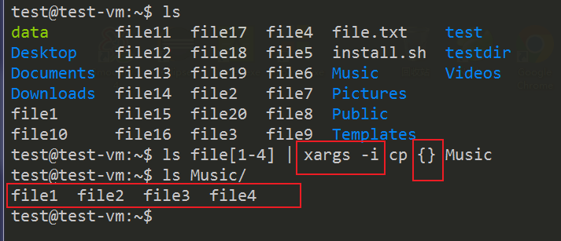

# lec-010

## review
1. 环境变量
   - 变量 没有类型 / 赋值时等号前后没有空格
   - $变量
   - export 环境变量
   - 修改 ~/.bashrc
   - PATH
2. 文件搜索
   - find
3. find 何处  何物  处理
   - 按照文件属性，进行搜索条件的叠加
   - 处理结果，-exec / -ok
   - find /usr  -name "file" -exec chmod 666 {} \;

## 
1. 隐藏 permission denied;  2> /dev/null
2. echo "hello world" > file
3. 为什么 open/creat返回的文件描述符是3

## 命令执行结果的重定向
1. 命令行执行命令，执行结果默认输出到屏幕
   - 执行结果也可以重定向到文件
2. 覆盖 > 
3. 追加 >>
   
4. 命令执行的正确结果，重定向到文件
   - 默认，正确的结果输出到stdout文件描述符，对应1 
   - ls ~ > file.txt
   - ls ~ 1> file.txt
   - 1可以省略
   
5. 命令执行也可能输出错误的结果，错误结果输出到stderr文件描述符，对应2 
   - ls /xxx 2> file.txt
   
6. 一个程序的文件描述符
   - 1 stdout 
   - 2 stderr 
   - open / creat, 只能从3开始

## stdout与sterr合并 
1. 执行某些命令，可能同时出现正确和错误的结果
2. 2>&1
3. ls /home 正确 
4. ls /xxx 错误 
5. ls /home /xxx 既有正确的，又有错误的
6. ls /home /xxx > file.txt 2>&1 合并正确和错误的，重定向到文件
   

## 标准输入stdin
1. 标准输入stdin 对应文件描述符0； 默认从键盘输入，也可把文件重定向到输入
2. 只有部分命令可以使用stdin 

## 处理数据流(字符串类型的数据)的命令
1. 既可以操作文件，也可以操作stdin的内容
2. sort 
   - 默认按照首字母
   - -n 按照数字排序
   - -r 逆序 
   - 如果有多列数据，可以选择某一列作为排序的标准
   - sort -nr -t : -k 3 /etc/passwd
   - -t 设置列分隔符； -k 选择某一列 
3. uniq [unique] 去掉相邻的重复行
   - -c 统计重复行的数量
   - -d 只显示重复的行
   - -u 只显示非重复的行 
   
4. wc [word count]
   - 行数，单词数，字节数 
   - -c 字节数 
   - -l 行数 
   - -w 单词数
   

## 管道 
1. 前一个命令的stdout --管道--> 下一个命令的stdin 
2. 对前一个命令的输出，做进一步的处理
3. |
4. sort data | uniq 
   

## xargs 
5. 管道，左侧命令的stdout, 传递给，右侧命令的stdin 
6. 有些命令没有stdout,  比如 mkdir, 不适合放在管道左侧 
7. 数据处理命令，sort, uniq，wc 能够接受stdin，可以放到管道右侧 
8. 有些命令不能接受stdin, 比如 ls， echo,  cp ， 不适合直接放到管道右侧
9. 如果某些命令不能接受stdin, 但是可以使用命令行的参数，则可以使用xargs，把管道左侧命令的stdout 转换成管道右侧命令 需要的 命令行的参数
10. head -3 /etc/passwd | xargs echo
    
11. cat file.txt | xargs ls 
    
12. 假设管道右侧命令的参数不止一个，比如cp 
    - ls file[1-4] | xargs -i cp {} Music 
    

## 总结 
1. stdin --> 命令 --> stdout / stderr 
2. stdout / stderr -- > / >> --> 重定向到文件 
3. 命令1 --> stdout | stdin --> 命令2 
4. 命令1 --> stdout | xargs --> 命令2 命令行参数
5. stdin --> sort / uniq / wc --> stdout 
6. ls / mkdir / cp / echo 命令行参数 --> stdout (可能没有)