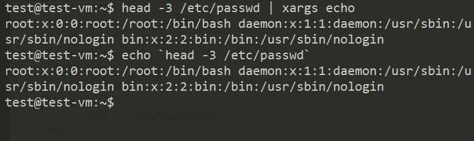
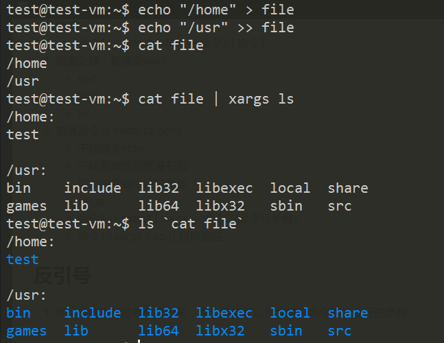
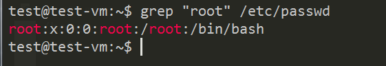
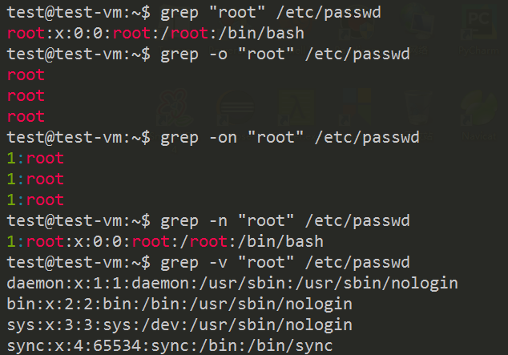
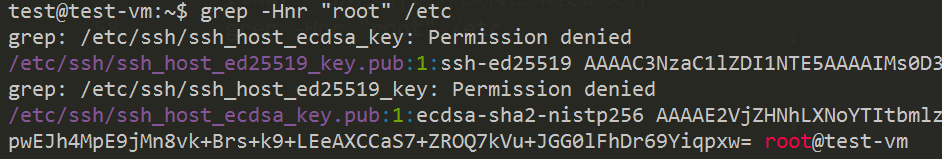
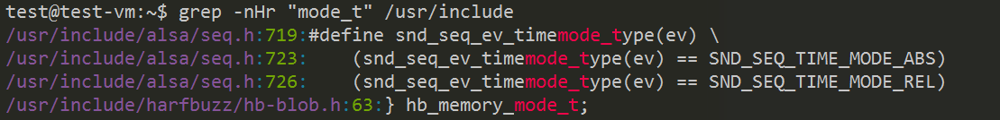
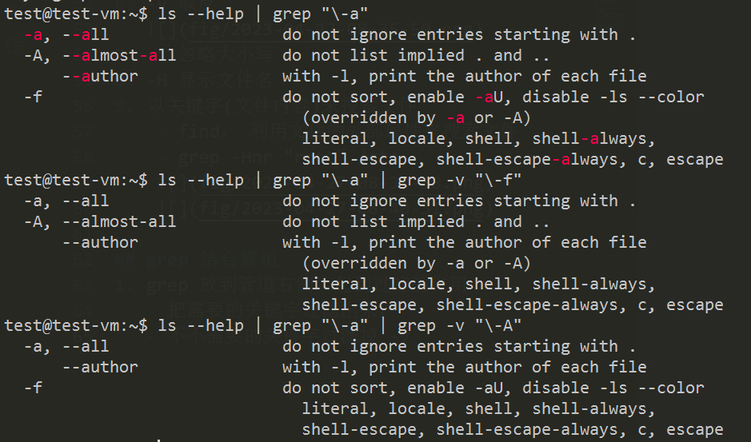
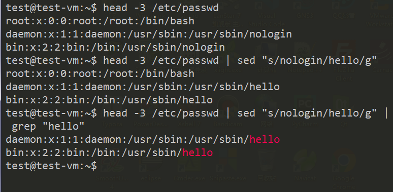
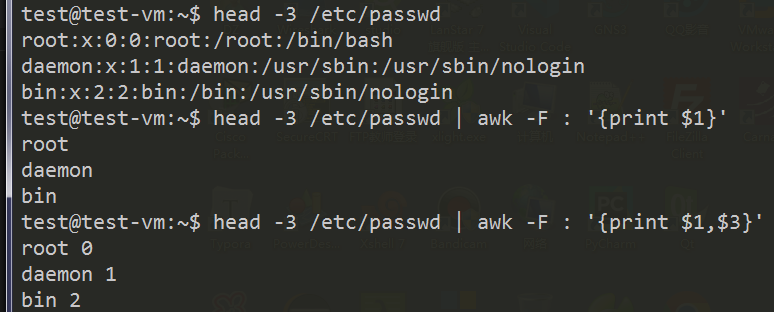

# lec-011

## review
1. 命令执行结果输出
   - 正确 stdout，1， 默认输出到屏幕
   - 错误 stderr, 2， ~~
2. 命令执行结果重定向
   - 命令 > 文件
   - 命令 >> 文件 
   - 2> / 2>>
   - 合并或者分开，错误和正确的结果
3. 管道
   - 命令1 -> stdout | stdin -> 命令2 | 命令3 
4. 数据处理，都接受stdin
   - sort 
   - uniq 
   - wc  
5. 普通命令 ls mkdir cp echo 
   - 不能接受stdin 
   - 不能直接放到管道右侧
   - 可以接受命令行的参数
   - xargs 
   - 命令1 -> stdout | xargs -> 命令2 (命令行参数)
   - 命令1 | xargs -i cp {} 目标路径

## 反引号 
1. 把命令的执行过程包裹起来，整个结果可以作为其它命令的命令行的参数
```
head -3 /etc/passwd | xargs echo
echo `head -3 /etc/passwd`
```

2. 另外一个例子
   


## 数据处理三剑客
1. grep 搜索匹配，过滤
2. sed 流编辑器，替换
3. awk 分列数据的处理， 取出其中一列(几列的数据) 
   

## grep 
1. grep 
   - Globally search a Regular Expression and Print 
2. 既可以直接操作文件，也可以放到管道右侧使用
3. 直接搜索关键字，输出关键字所在行的内容
   - grep "root" /etc/passwd 
   
4. -o 仅仅输出搜索的关键字
5. -n 显示行号 
6. -v 取反
   
7. -i 忽略大小写
8. -H 显示文件名
9. 以关键字(文件内容)来搜索文件
    - find， 利用文件的外部属性来搜索文件
    - grep -Hnr "root" /etc
    
    

## grep 结合管道 
1. grep 放到管道右侧，起到过滤的作用
   - 把需要的关键字过滤出来，
   - 不不需要的关键字过滤掉 -v
2. 查看命令的帮助，过滤出需要查看的选项
   `ls --help | grep "\-a" | grep -v "\-A"`   
   

## sed 
1. stream editor 
2. 流编辑器，主要使用替换的功能 
3. s/old/new/g 
   - s 体会命令
   - g 全局 针对某一行 
4. sed "s/nologin/hello/g" /etc/passwd
   
5. vim 编辑器 
   - :%s/nologin/hello/g

## awk 
1. Alfred Aho，Peter Weinberger, Brian Kernighan
2. 分列数据处理，取出某一列(某几列)数据
3. head -3 /etc/passwd | awk -F : '{print $1,$3}'
   - -F 指定列的分隔符，默认空格和TAB 
   - {print $1,$3} 打印每一行的第1列和第3列
   
4. sort -t : -k 3 /etc/passwd