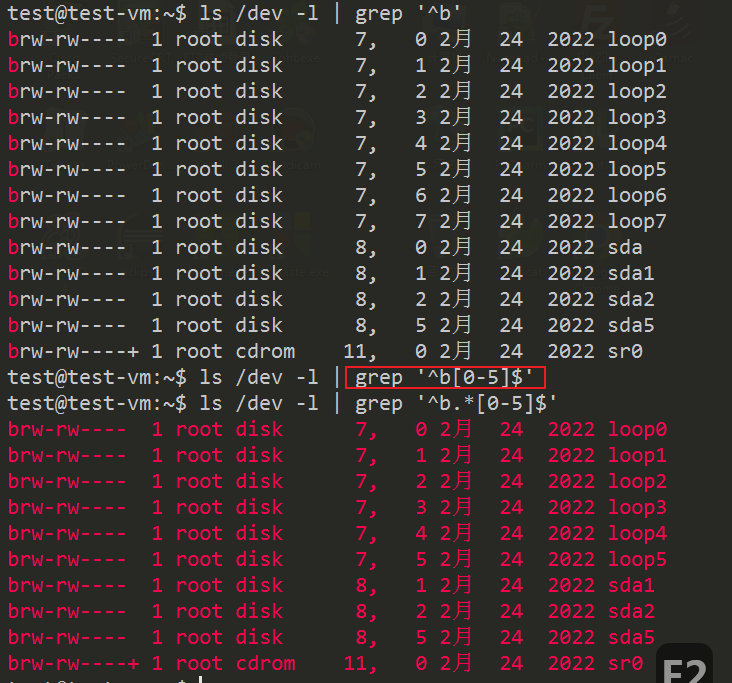
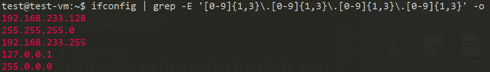

# lec-012

## review
1. 反引号
   - 管道右侧的命令，接收stdin
   - xargs
```
命令1 | xargs 命令2
命令2 `命令1`
```
2. 数据处理
   - 通常放到管道右侧 
   - grep 搜索过滤，一定规则
   - sed 流编辑器，sed 's/old/new/g'
   - awk 分列数据处理， awk -F : '{print $1, $5}'
3. grep 关键字
   - 把关键字所在行的内容，或者关键字过滤出来，或者把关键字所在行的内容过滤掉
   - -o 
   - -v 取反
   - -n 
4. grep 根据文件的内容(关键字)，搜索文件 
   - grep -inHr '关键字'  /usr


## 正则表达式
1. 一个字符串
2. 普通字符 + 特殊字符(meta字符) --组成--> 模式pattern
3. 用途，将某个模式(正则表达式)，与所要搜索的原始字符串进行匹配
4. 简单说，有一堆杂乱无章的原始的字符串，目的是想从中精确地匹配出一些子串(不是确定的某个字符串)


## 正则的例子
```
[a-z0-9_]+@[a-z0-9]+\.[a-z]+

[0-9]{1,3}\.[0-9]{1,3}\.[0-9]{1,3}\.[0-9]{1,3}
```

## 用处
1. grep 
2. awk 
3. sed 
4. vim
5. man
6. 编程语言
   - python re

## 规则
```shell
字符：\      	转义字符   一般的编程语言都有
例子：\\， \(

字符：[xyz]  	匹配所包含的任意一个字符  类似通配符
例子：a[xyz]b 	匹配 axb，ayb，azb

字符：[a-z]  	匹配指定范围内的任意字符  大概的替代方案[:num:]
例子：[0-9]

字符：[^xyz]  	匹配未列出的任意字符   取反
例子：[^abc]  	匹配"plain"中的"plin"

字符：[^a-z]  	匹配任何不在指定范围内的任意字符

字符：. 匹配除\n之外的任何单个字符  类似通配符里? 
例子：abc..  abcxx abc12 abc1h

字符：^  匹配行首  联系到vim的快捷键
例子：^/etc   
/etc/apt/sss
/etc/aaa
/etc/xxx

字符：$  匹配行尾  联系到vim的快捷键
例子：conf$		

^$  空白行

--- 

字符： x｜y   	匹配x或y
例子：abc | xyz

字符：(pattern)	匹配pattern，提高优先级
例子：(abc) 
```


## 匹配次数
1. 不能单独使用
2. 与前面的子表达式联合使用
   - 子表达式？
   - 一个普通的字符 比如 a 
   - (字符串)
   - 一些特殊的字符  比如 .
```shell
字符：*		匹配前面的子表达式零次或多次   通配符里*代表任意字符0次或多次
例子：zo*  	匹配 z，zo，zoo  

字符：+		匹配前面的子表达式一次或多次
例子：zo+ 	匹配 zo，zoo，不匹配 z

字符：?		匹配前面的子表达式零次或一次  通配符里?单个任意的字符一次
例子：do(es)? 	匹配 do，does

字符：{n}	匹配确定的n次
例子：o{2}	 不匹配Bob中的o，匹配food中的两个o

字符：{n, }	至少匹配n次
例子：o{2,} 不匹配Bob中的o,匹配foooood中的所有o

字符：{n, m}	最少匹配n次且最多匹配m次
例子：o{1,3}	匹配fooooood中的三个o
```

## 深入学习
1. [菜鸟教程](https://www.runoob.com/regexp/regexp-syntax.html)
2. [可视化正则](https://jex.im/regulex)
3. [在线正则匹配](https://regexr.com/)


## 例子 
```
# email 
[a-z0-9_]+@[a-z0-9]+\.[a-z]+   # x_x1223x@yyy.ttt

# 数字IP地址
[0-9]{1,3}\.[0-9]{1,3}\.[0-9]{1,3}\.[0-9]{1,3}   # 5.35.123.87
```

## 查看设备文件
1. ls -l /dev | grep '^b'
2. ls -l /dev | grep '^b.*[0-5]$'


## 查看IP地址
ifconfig | grep -E '[0-9]{1,3}\.[0-9]{1,3}\.[0-9]{1,3}\.[0-9]{1,3}' -o 

