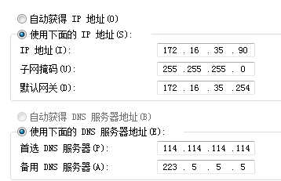
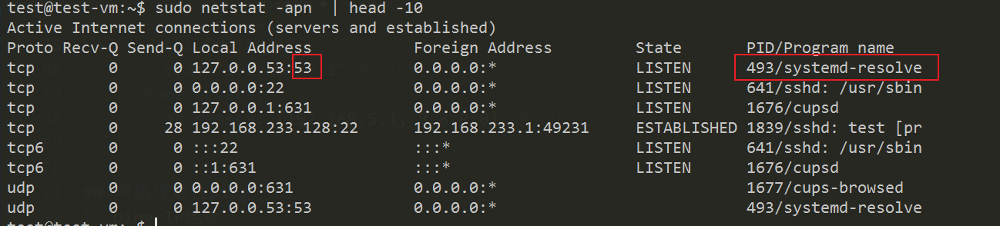

# lec-013

## review
1. 正则表达式
   - 规则
   - 特殊字符， ^, $, [], (), |, .
   - 重复次数， *, +, ?, {n}, {n,m}, {n,}
   - 贪婪, 抑制贪婪 *?, +?
2. grep, awk, sed, vim, man, 编程语言

## 网络管理
1. 查看和修改网络配置
2. 测试网络的连通性
3. 查看端口的使用
4. 域名解析
5. 网络服务的配置

## 查看网络配置  ifconfig
1. ifconfig ens33 查看一块网卡
2. 卸载网卡  sudo ifconfig ens33 down 
3. 加载网卡  sudo ifconfig ens33 up
4. 设置IP地址 sudo ifconfig ens33 192.168.11.23
5. ip a 

## 网络配置
1. IP地址
2. 子网掩码
3. 网关
4. DNS服务器
5. 如果要自动获得IP地址，必须确保局域网内有一个DHCP服务器能分配IP地址


## Linux网络配置
1. NetworkManager  网络管理工具
   - 在后台运行(服务)
   - sudo systemctl status NetworkManager
   - sudo systemctl restart NetworkManager
2. netplan 配置网络
   - 修改配置文件 /etc/netplan/*.yaml
   - sudo netplan apply 加载网络配置，必要时会重启网络管理工具
   - netplan get 查看当前网络配置
3. 默认配置
```yaml
# NetworkManager会默认管理所有以太网设备和WiFi设备，默认以DHCP的方式启动这些以太网设备,
network :
  version : 2
  renderer : NetworkManager 
```
4. 手动配置
```yaml
network:
  version: 2
  renderer: NetworkManager
  ethernets:

    enp0s1: # 第1块网卡 
      dhcp4: true # 自动获得IP 

    enp0s2: # 第2块网卡
      addresses: [192.168.5.3/24]  # 手动设置IP/子网掩码  
      # 24即用32位二进制表示的子网掩码中有连续的
      # 24个1：11111111 11111111 11111111 00000000，
      # 将其转化为十进制，就是：255.255.255.0
      routes:
      - to: "default"
        via: "192.168.5.1" # 网关 
      nameservers: 
        addresses: [192.168.5.1, 8.8.8.8]  # DNS   
```

## 网络连通性ping 
1. ping IP地址
2. ping 域名  -c 4 
3. ping www.baidu.com -c 3


## 端口 netstat 
1. 查看端口的占用情况，端口号，进程
2. sudo  netstat -apn 
3. a 所有状态，包括监听等
4. p 查看占用端口的程序名
5. n 以数字的方式显示地址 


## 域名解析
1. dig / nslookup 
2. dig www.baidu.com 


## 网络服务的配置
1. web服务， nginx, apache 
2. 文件服务, ftp 
3. ssh服务, openssh-server

## 网络服务配置的一般流程
1. 安装软件  sudo  apt install  XXX
2. 修改配置文件  sudo  vim  /etc/XXX/XXX.conf
3. 重新加载配置文件  sudo  systemctl  reload  XXX.service 
4. 有些服务需要准备额外的资源文件   /var/XXX


 

