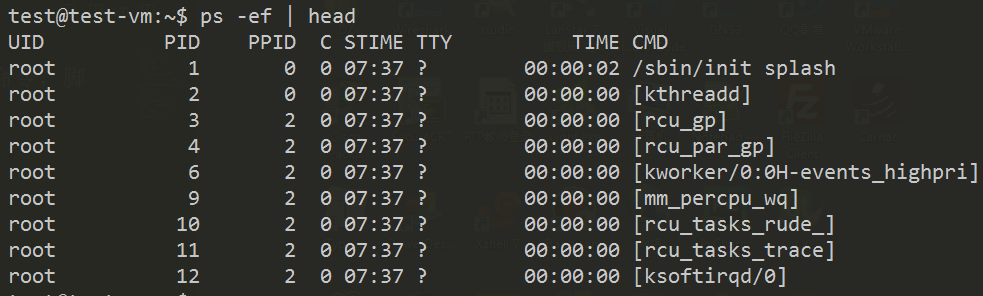
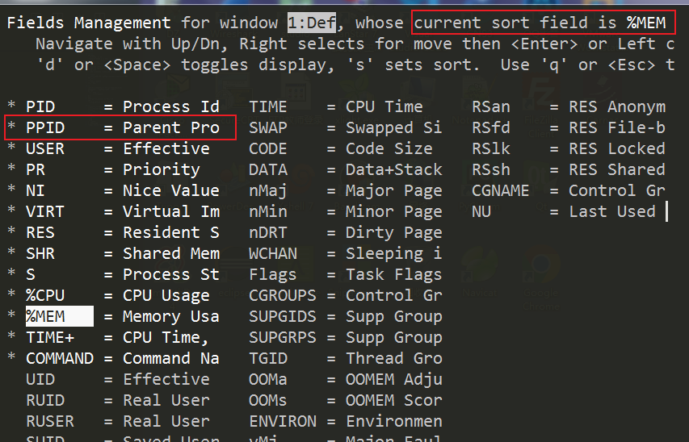
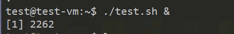
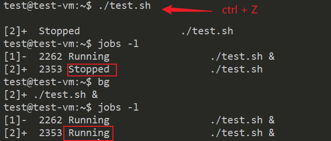
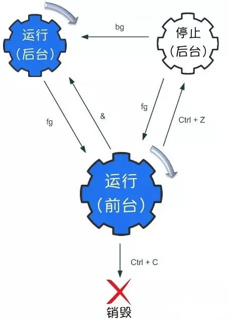

# lec-014

## review 
1. 网络管理
   - ifconfig  /  ip
   - netplan apply /  *.yaml  /  NetworkManager
   - ping
   - netstat -apn
   - dig  / nslookup 
2. 网络服务
   - sudo apt install XXX  /  docker
   - sudo vim /etc/XXX/XXX.conf
   - /var/XXX
   - sudo systemctl reload XXX.service

## 进程管理
1. 进程，在内存中运行起来的程序，包括命令，脚本，服务等
2. 查看进程
3. 进程退出
4. 前后台进程的切换
5. 周期性的任务

## ps 
1. report a snapshot of the current processes
2. 静态的查看进程的状态，获得一个快照 
3. ps -ef 
   - e 所有的进程 
   - f 所有格式的信息
4. UID 
5. PID
6. PPID parent process ID 父进程ID 
7. CMD
   

## top
1. 动态查看进程实时的信息
2. 上半部分，统计信息
   - zombie 
3. 下半部分，进程信息
   - PID
   - USER
   - S 状态
   - CPU
   - MEM 
4. h 进入帮助 
5. d 设置刷新率
6. f add/remove/order/sort 
   
7. q / ctrl + c 退出
8. 追踪几个进程 top -p  PID1, PID2 

## kill
1. send a signal to a process
   - signal 用于进程间的通信 
   - 附属功能：让进程自杀
2. kill -l 查看可用的信号 
3. kill PID 默认发送信号15
4. kill -4 PID 发送信号4给进程PID
5. Ctrl + C 发送信号2 
6. 进程收到信号，比如2,15
   - 程序默认不处理信号
   - 默认的行为是退出
   - 也就是自杀
7. 假设，程序处理了信号
   - 默认行为可能就不是自杀
9. 后门，信号9
   - 程序内处理了信号9，无效

## 前后台进程切换
1. 有些程序
   - 死循环
   - 耗时的计算
2. 后台运行，& 
   - ./test & 
   
3. 已经在前台运行，怎么办
   - Ctrl + z 转入后台， 进程进入停止状态
   - jobs -l  查看后台的进程
   - \+ current job 
   - \- previous job 
   - bg [job number] 停止 -> 运行 
   
   - fg [job number] 返回前台 
   

## 周期性的任务
1. cron 后台服务
   - 定期查看周期性任务的配置，来运行周期性的任务
2. 按照一定的规则设置周期性的任务
   - 时间 + 任务 
3. crontab -e 设置周期性任务
   - 其实就是打开编辑器，编辑某个配置文件
