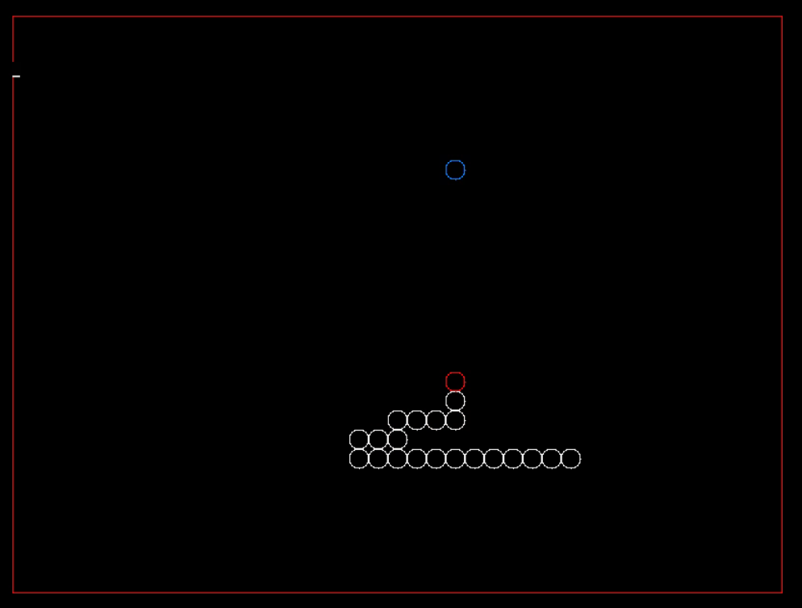

[TOC]

---
# 实训

## 规则 
1. 最多三人一组，一组一份纸质报告，多人一组，写清楚每人的工作量
2. 必须使用Latex写报告，不能使用Word写报告
4. 每天不定时签到
5. 一共4天，每天检查实践成果 
6. 上午8:30-11:30, 下午14:30-17:30

## 目的
为了更加深入理解Linux系统操作和系统编程，为后续的操作系统，编程等课程夯实基础。

## 内容
完成一个基于framebuffer的绘图系统，实现分形龙的绘制

## 过程

注意: 文字描述+截图等方式记录实验过程，详述实验中遇到的问题和解决方案

1. 操作framebuffer
   - framebuffer基本概念知识
   - apt安装相应软件
   - ffmpeg操作framebuffer
   - cat操作framebuffer
   - fbset查看framebuffer属性
   - ffmpeg转换raw图像
2. 读取framebuffer信息
   - framebuffer的open和close 
   - ioctl获得framebuffer信息
3. 读取framebuffer数据
   - read读取framebuffer的内容
   - write写入raw文件
4. bmp格式转换
   - bmp文件格式
   - bmp文件头的设置
   - bmp文件信息设置
   - bmp文件头和raw数据写入
5. framebuffer写入数据
   - framebuffer的mmap映射
   - framebuffer中点的位置确定
   - framebuffer中点的颜色设定
   - framebuffer中点的绘制
6. framebuffer画线
   - 线段的绘制
7. framebuffer画多段线
   - 多段线的绘制
8. framebuffer操作CPP封装
   - 面向对象封装framebuffer的操作
   - 初始化
   - 画点
   - 画线
   - 画多段线
9. framebuffer绘制分形龙
   - 分形的知识
   - 分形龙的知识
   - 分形龙顶点算法
   - 实现分形龙顶点的计算
   - 绘制分形龙
10. 拓展任务 

## 结果展示

