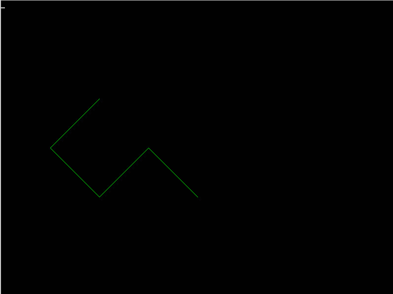

[TOC]

---
# 操作framebuffer

## 基本知识
1. framebuffer, 直译就是，帧缓存
2. frame, 帧：你所看到的屏幕的图像，或者在一个窗口中的图像，就叫一帧。
3. buffer缓存：一段RAM，用来暂存图像数据，这些数据会被直接写入到显示设备。
4. framebuffer通常对应/dev/fb0设备，它和/dev下面的其他设备没有什么区别，用户可以把framebuffer 看成一块内存，既可以向这块内存中写入数据，也可以从这块内存中读取数据。
5. 先来看framebuffer的读取
   - 可以用程序读取framebuffer，比如cat，或者ffmpeg
   - 或者写代码调用API来读取framebuffer


## ffmpeg 获得 framebuffer 的数据
1. 将 prac-001 目录下的 main.zip 解压缩，把期中main文件复制粘贴到虚拟机的桌面上
2. 在虚拟机里打开terminal
   - 或者在Windows里打开cmder， ssh 远程连接虚拟机
   - 注意远程连接之前先打开windows下的两块虚拟网卡 
   - ssh test@虚拟机IP地址
   - 密码 asdf 
3. 在命令行里切换到虚拟机桌面目录 
4. 修改main文件的权限，增加一个可执行权限
5. 运行main `sudo ./main`
6. 运行ffmpeg `sudo ffmpeg -f fbdev -i /dev/fb0 out.jpg`
7. 执行结果出现 "Conversion failed!" 等信息，可以忽略 
8. framebuffer中的数据直接被保存成jpg图像文件 
9. 直接打开out.jpg，查看其内容，结果如下 


## cat 获得 framebuffer 的数据
1. 操作步骤
```
# 把framebuffer中的数据直接保存出来
# 生成一个raw格式的图片
sudo cat /dev/fb0 > screen.raw 
```
2. raw是一种无压缩的图像数据格式，需要特殊软件才能查看其内容，我们稍后来将其转换成png图像格式
3. 查看一下 screen.raw文件的大小 


## 查看framebuffer信息
1. 利用fbset查看framebuffer信息 `sudo fbset`
2. 最主要的信息是分辨率和色深bpp((bits per pixel 每个像素点需要几个bit) 
3. 参考结果如下(注意你得到的不一定是下面的结果)
```
mode "480x272"
        geometry 480 272 320 200 16
        timings 9009000 2 2 2 2 41 10 
        rgba 5/11,6/5,5/0,0/0
endmode
# geometry 480 272 320 200 16 含义如下 
# 屏幕实际分辨率宽度480, 高度272, 虚拟分辨率宽度320, 高度200, bpp 16，也就是每个像素点需要16个bits，或者说2个bytes的数据来表示
```
4. 思考一个问题，这里分辨率，色深等参数，和上面的screen.raw文件大小的关系是什么？

## 利用ffmpeg手动转换raw
1. 利用ffmpeg转换raw到png，参考命令如下
```  
# 其中 screen.raw 就是 之前用cat从 /dev/fb0获得的数据文件
# 注意，800x600替换成上一个步骤中fbset查看得到的屏幕的虚拟分辨率
ffmpeg -vcodec rawvideo -f rawvideo -pix_fmt rgb0 -s 800x600 -i screen.raw -f image2 -vcodec png screen-%d.png 
```
2. 查看转换出来的screen-1.png，其内容应该和out.jpg一致(除非中间进行了其它操作)，不过二者的分辨率可能有差别 


## 小结
1. ffmpeg  /dev/fb0 -> out.png 
2. cat     /dev/fb0 -> screen.raw 
3. ffmpeg  screen.raw -> screen-1.png 
4. out.png == screen-1.png
