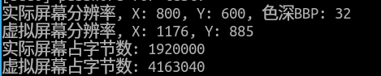

[TOC]

---
# framebuffer信息

## 读取framebuffer信息
1. 在第一个实践中，我们使用命令fbset获得了framebuffer的信息
2. 我们也可以利用IO系统调用函数，使用代码的方式来获取framebuffer信息
3. 完成fb_info.c中的TODO
4. IO系统调用可以参考 [Linux系统应用第8章](http://mooc1.chaoxing.com/mooc-ans/nodedetailcontroller/visitnodedetail?courseId=223267590&knowledgeId=566249116)
5. struct fb_var_screeninfo 参考如下 
```Cpp
struct fb_var_screeninfo {  
	//struct fb_info的成员（可变参数），其记录用户可修改的显示控制器的参数，包括分
   //辨率和每个像素点的比特数，其成员需要在驱动程序中初始化和设置
               
	//*******可见分辨率（实际屏幕）*******             
	__u32 xres;// visible resolution//定义屏幕一行有多少个像素点 
	__u32 yres;                     //定义屏幕一列由多少个像素点 
 
	//*******虚拟分辨率（虚拟屏幕）*******
	__u32 xres_virtual;// virtual resolution //虚拟屏幕一行有多少个像素点 
	__u32 yres_virtual;                      //虚拟屏幕一列由多少个像素点
	__u32 xoffset;// offset from virtual to visible  //虚拟到可见（实际）之间的行方向偏移 
	__u32 yoffset;// resolution                      //虚拟到可见（实际）之间的列方向偏移 
 
	__u32 bits_per_pixel; // guess what      //每像素位数(多少BPP) 
	__u32 grayscale; // != 0 Graylevels instead of colors   //非0时指灰度 
 
	//*******fb缓存的RGB位域*********
	struct fb_bitfield red;// bitfield in fb mem if true color,  // fb缓存的红色位域
	struct fb_bitfield green;// else only length is significant  // fb缓存的绿色位域
	struct fb_bitfield blue;                                     // fb缓存的蓝色位域
	struct fb_bitfield transp;// transparency                    //透明度 =0  
 
	__u32 nonstd;// != 0 Non standard pixel format //非标准像素格式时应该为非0值 (标志像素格式时 nonstd=0)  
 
	__u32 activate;// see FB_ACTIVATE_*   //查看宏FB_ACTIVATE_NOW  
 
	__u32 height;// height of picture in mm  // 高度
	__u32 width;// width of picture in mm    // 宽度  
 
	__u32 accel_flags;// (OBSOLETE) see fb_info.flags  //查看fb_info.flags  
 
 
  //***********这参数必须通过查看LCD数据手册得到*************
    // Timing: All values in pixclocks, except pixclock (of course) 
	__u32 pixclock; // pixel clock in ps (pico seconds)  //像素时钟（皮秒），pixclock=1/Dclk=... 
 
	// 行切换，从同步到绘图之间的延迟即HFPD(有效数据之后无效的像素的个数) ，对应于LCD数据手册的Hsyn的front-porch
	__u32 left_margin; // time from sync to picture   
	//行切换，从绘图到同步之间的延迟即HBPD(Hsyn脉冲下降沿之后的无效像素的个数) ,对应于LCD数据手册的Hsyn的back-porch					   
	__u32 right_margin; // time from picture to sync   
	//帧切换，从同步到绘图之间的延迟即VFPD(有效数据之后还要经历的无效行数(之后是下一帧数据)) ，对应于LCD数据手册的Vsyn的front-porch					  
	__u32 upper_margin; // time from sync to picture    
	//帧切换，从绘图到同步之间的延迟即VBPD(Vsyn脉冲下降沿之后还要经历的无效行数) ，对应于LCD数据手册的Vsyn的back-porch 
	__u32 lower_margin;  
	//水平同步的长度即HSPW(Hsyn信号的脉冲宽度)，对应于LCD数据手册的Hsyn的pulse Width  					 
	__u32 hsync_len;  // length of horizontal sync
	//垂直同步的长度即VSPW(Vsyn信号的脉冲宽度)，对应于LCD数据手册的Vsyn的pulse Width 
	__u32 vsync_len;  // length of vertical sync    
 
	__u32 sync;   // see FB_SYNC_*          // 查看宏FB_SYNC_
	__u32 vmode;  // see FB_VMODE_*         //  查看宏FB_VMODE_ 
	__u32 rotate;  // angle we rotate counter clockwise  //顺时钟旋转的角度 
	__u32 reserved[5]; // Reserved for future compatibility   // 
 }; 
```
4. 建议把源代码所在目录共享到虚拟机
   - VmWare - 菜单栏 - 虚拟机 - 设置 - 选项 - 文件夹共享 - 添加 - 选择源码所在目录
   - 虚拟机中 共享目录在 /mnt/hgfs
5. 在Windows下编辑源代码，在Linux虚拟机中编译运行
6. 编译 `gcc fb_info.c -o fb_info`
7. 运行 `sudo ./fb_info` 
8. 参考结果如下


 

## 小结
1. open
2. ioctl -> fb_var_screeninfo
3. close