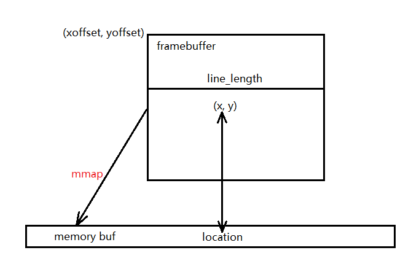
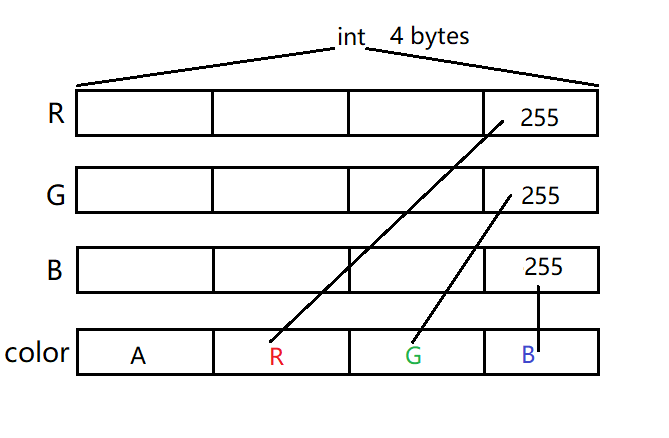
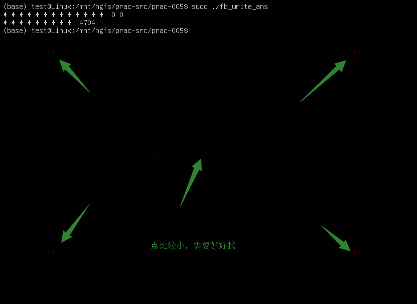

[TOC]

---
# framebuffer写入数据

上一个实践中，我们从framebuffer读数据，是利用IO系统调用read()函数，从设备/dev/fb0从读取。反过来，如果要向/dev/fb0中写数据，很自然的想法是利用write()函数。

不过，这里有两个问题，一是根本无法对/dev/fb0进行write操作；二是，即使可以进行write，也不够灵活。

因为framebuffer的最终结果是显示在屏幕上的图像，如果我们仅仅是想通过写数据，改变屏幕上某个局部的内容，比如在屏幕上画几个点，或者画几根线。如果用write的方式，我们要把整个屏幕的数据准备好，并且在需要画点或者画线的位置，利用与背景颜色的差异，改变整个屏幕中某些局部的数据，然后写入framebuffer。

更加灵活的做法是把二维的framebuffer映射到一维的内存中，直接改变内存中的数据，来间接地改变framebuffer中的数据，达到向framebuffer写入数据的效果。

我们先来看最简单的，在framebuffer上画点的操作。通常来说，framebuffer的默认颜色是黑色的，也就是说屏幕上所有的像素点都是黑颜色，如果要在其上画点，我们需要两个条件，点的坐标和点的颜色，比如把屏幕上(100, 100) 位置的点画成红色。

操作framebuffer，在其上画点的大概步骤如下 
1. 利用mmap()把framebuffer(二维)映射到内存buf(一维)。
2. 一个点在framebuffer上二维坐标(x,y)，可以通过framebuffer的相关参数，转换这个成这个点在内存buf中的位置location，
3. 最后直接在buf的location位置上设置这个点的RGB颜色值，即可以间接改变framebuffer中相应的二维坐标(x,y)处点的颜色值，从而实现画点的功能。

## mmap
1. 作用，把framebuffer(二维)映射到内存的buf中(一维)
2. 为了进行正确的映射，需要知道framebuffer的虚拟屏幕所占字节数 screensize
3. 虚拟屏幕分辨率 xres_virtual, yres_virtual
4. screensize = xres_virtual * yres_virtual * 每个像素所需字节数

## 如何确定一个点的位置
1. framebuffer的原点在左上角，已知一个点在framebuffer上坐标(x, y)，如何确定其在buf上的位置location 
3. 虚拟屏幕与实际屏幕的坐标偏移是 xoffset, yoffset
4. 虚拟屏幕一行所有像素点所需要的字节数 line_length
5. 则 location = (x + xoffset) * 每个像素所需字节数 + (y + yoffset) * line_length

## RGB颜色 -> color

## 注意 
1. 在桌面环境下，无法看到framebuffer的写操作结果
2. 需要切换到虚拟终端环境下
3. Ctrl + Alt + F2，可以切换到tty2虚拟终端
   - 利用test用户登录，密码asdf
4. Ctrl + Alt + F7，可以切换回桌面环境

## 任务  
1. 完成fb_write.c中的TODO 
4. 封装画点函数draw_point()
5. 分别在 屏幕四个角(向内偏移100)，和中心处画5个点 
   - 颜色是红色 
   - 注意, 屏幕的大小是实际屏幕的大小
   - 屏幕的原点在左上角

6. 如果一个点的坐标超过了屏幕的范围会怎么样
   - 在代码中测试一下，修正可能出现的问题
   - 提示，可以测试一些超过屏幕的实际分辨率，或者虚拟分辨率范围的 特殊点 
   - 提示, 完善draw_point函数，如果点越界了, 就直接返回，不要画出来

## 小结
1. framebuffer --mmap--> memory buffer
2. (x, y) ----> location
3. RGB ----> color
4. memory buffer  --draw_point--> framebuffer

