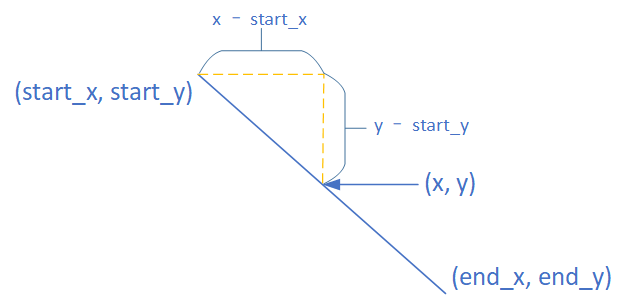
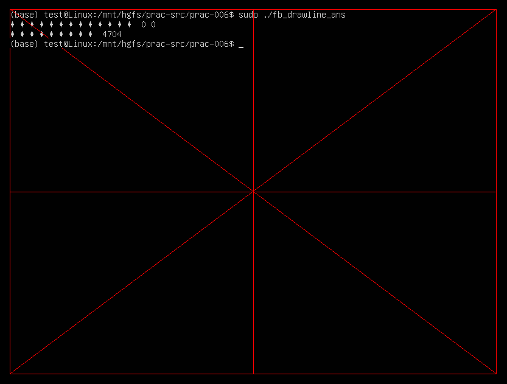
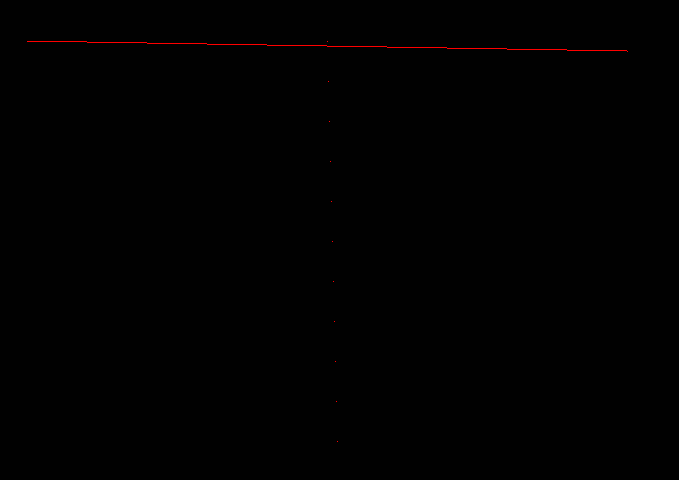
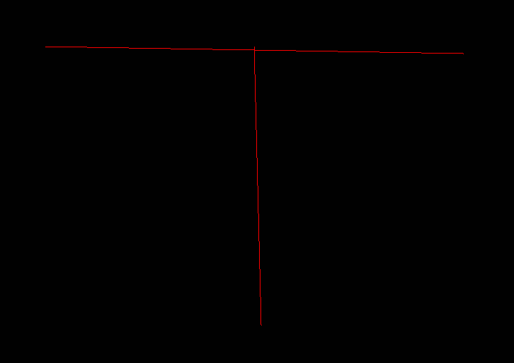

[TOC]

---
# framebuffer画线

之前，我们已经完成在framebuffer上画点(x, y)，接着，我们就可以来画线了。这里的线指线段，由起点坐标(start_x, start_y), 终点坐标(end_x, end_y)确定。只要我们计算出在起点和终点之间的每个点，调用draw_point()函数，把这点全画出来，就可以把线画出来了。

## 如何计算出在起点和终点之间的每个点
1. 起点坐标(start_x, start_y)
2. 终点坐标(end_x, end_y)
3. 在起点和终点中间的某每个点(x, y) 如何确定呢？
   - x 可以 通过 遍历 start_x 到 end_x 之间的每个值得到
   - y = (x - start_x) * 斜率 + start_y

## 任务  
1. 完成fb_drawline.c中的TODO
2. 实现画线函数draw_line()
3. 在 屏幕中央画一个十字线，颜色红色
4. 在 屏幕四周画一个框，颜色红色, 
5. 在 框上画对角线，颜色红色
6. 注意, 屏幕的大小是实际屏幕的大小, 不要越界
7. 计算好起点和终点

## 一个严重的bug 
1. 修改代码，绘制一条水平但稍微偏折的线，比如从(100, 100)到(700, 110)
2. 绘制一条垂直但稍微偏折的线，比如从(400, 100)到(410, 500)，结果可能如下
   
3. 可以看到，其中的水平偏折的线应该没有问题，而垂直偏折的线有很明显的问题
4. 尝试修复这个bug，得到以下正确的结果
   
5. 提示，这个bug和我们目前对某个点坐标的遍历方式有关，我们仅仅考虑了其中一半的情况。

## 小结
1. 线段 --转换--> 点
2. draw_point ----> draw_line

