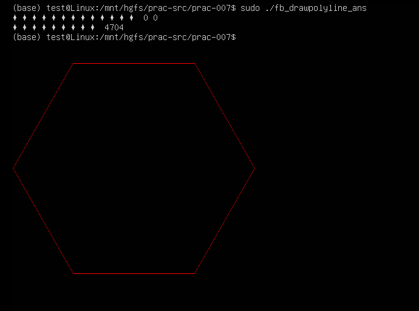

[TOC]

---
# framebuffer画多段线

在画点，画线的基础上，我们来画多边形。很明显，画多边形其实还是画线，只不过，要画多条线段。比如四边形，就是画四条线。一个点由坐标(x, y)表示，一条线段由起点坐标(start_x, start_y)和终点坐标(end_x, end_y)表示，而一个多边形，可以用多个点坐标来表示。如果起点和终点重合，则是闭合的多边形，如果起点和终点不重合，则是开口的多段线。其实可以用多边形仅仅是多段线的一个特例。

## 任务  
1. 完成fb_drawpolyline.c中的TODO
2. 实现画多段线函数draw_polyline()
3. 在屏幕上画一个正六边形，边长200
	- 颜色红色
	- 左上角顶点(100, 100)

4. 提示，为了获得正六边形的六个顶点，我们有多种方式来计算
5. 第1种，根据已知左上角的顶点，利用正弦和余弦定理，逐个计算其它每个顶点
6. 第2种，根据已知左上角的顶点，先利用正弦和余弦定理，计算出中点，再根据中点，计算其它顶点
7. 如果用的三角函数，编译时需要加上 -lm 
   - `gcc *.c -o main -lm` 

## 小结
1. 多段线 --转换--> 线段 --转换--> 点
2. draw_point ----> draw_line ----> draw_polyline

