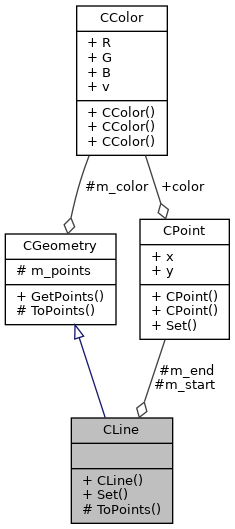
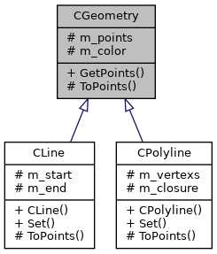
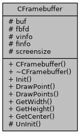
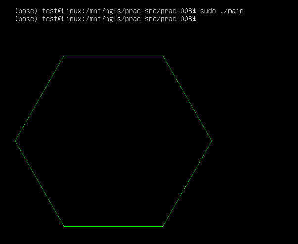

[TOC]

---
# framebuffer操作CPP封装

前面我们已经能够用framebuffer绘制点，线段，多段线，一个简单的绘图系统已经完成了。随着功能的完善，我们有必要把代码重构一下，按照面向对象的思想把其中的图形和绘图两部分分离抽象出来。
我们封装以下及各类
- CColor 抽象颜色
- CPoint 抽象点
- CGeometry 这是所有几何图形的父类，其中的ToPoints()函数用于把图形转换成绘图用的点 
- CLine 抽象线段 
- CPolyline 抽象多段线 
- CFramebuffer 封装Framebuffer的功能，其中的DrawPoints()函数用于绘制图形 

类图关系如下 


---



---



## 任务
1. 完成Line.cpp 中的TODO
2. 完成Polyline.cpp中的TODO 
3. 完成Framebuffer.cpp中的TODO
4. 完成main.cpp中的TODO 
   - 绘制正六边形，边长200，左上角端点(100, 100)
5. 编译 `g++ -o main *.cpp -lm`
6. 结果如下 



## 数据结构 vector 
1. 在C语言中我们使用数组来存储多段线的顶点，在CPP中我们可以使用CPP标准库中的数据结构vector
2. [vector](https://cplusplus.com/reference/vector/vector/)是一个模板，可以套用在所有的基本数据类型，以及自定义的类上
   - vector<int> 用于int的vector
   - vector<CPoint> 用于CPoint自定义类的vector 
3. vector的声明
```CPP
vector<int> my_int_vector; // 不用指定长度，vector根据实际情况，自动增长

typedef vector<int> IntVector; // 利用typedef定义一个数据类型的别名
IntVector my_int_vector; 

```
4. 和数组类似，vector也可以进行遍历
```CPP
// 遍历数组 
int myarray[10];
for(int i=0; i<10; ++i)
{
   printf("%d\n", myarray[i]);
}

// 遍历vector 
vector<int> myvector; // 不用指定长度，vector根据实际情况，自动增长
for(int i=0; i<myvector.size(); ++i)
{
   printf("%d\n", myvector[i]);
}

```
4. vector的其它操作 
```CPP
// 在尾部加入新的元素
vector<int> myvector;
int element = 10;
myvector.push_back(element);
myvector.push_back(20);

// 清空所有元素
myvector.clear();

// 两个vector拼接 
vector<int> first_vector;
vector<int> second_vector;

first_vector.insert(
   first_vector.end(),  // 在第一个vector的尾部
   second_vector.begin(), // 第二个vector的头
   second_vector.end());  // 第二个vector的尾
```


## 小结
1. CPoint 
2. CFramebuffer 
3. main 
 


