[TOC]

---
# framebuffer绘制分形龙

分形是一种局部与整体自相似的图形，我们使用framebuffer来绘制一个简单的分形龙，之前封装好的CFramebuffer的DrawPolyline可以直接使用，剩下来的关键问题是，如果计算分形龙的每个顶点。

## 分形
1. 简单介绍一下[baiduwiki](https://baike.baidu.com/item/%E5%88%86%E5%BD%A2/85449)

2. [分形软件](https://blog.csdn.net/weixin_28710515/article/details/89843940)

## 分行龙
1. 折纸游戏
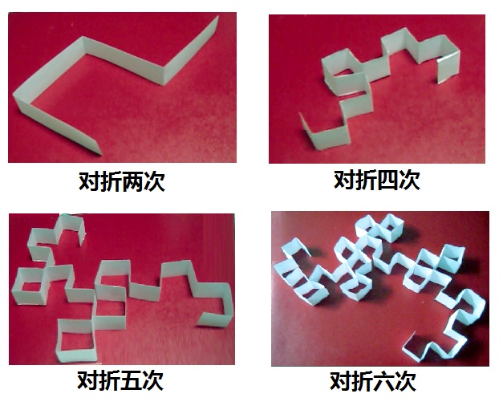
2. 图片展示
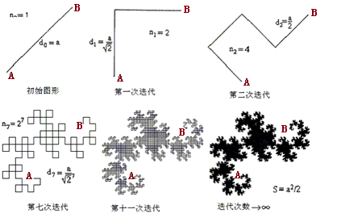

## 分行龙端点计算
1. 求两点的中心
2. 求过中心的垂线
3. 在垂线上找到两点，判断到中心的距离
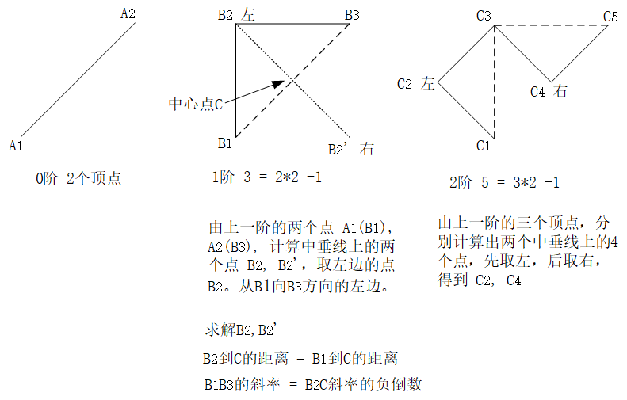
4. 判断左右方向，取舍
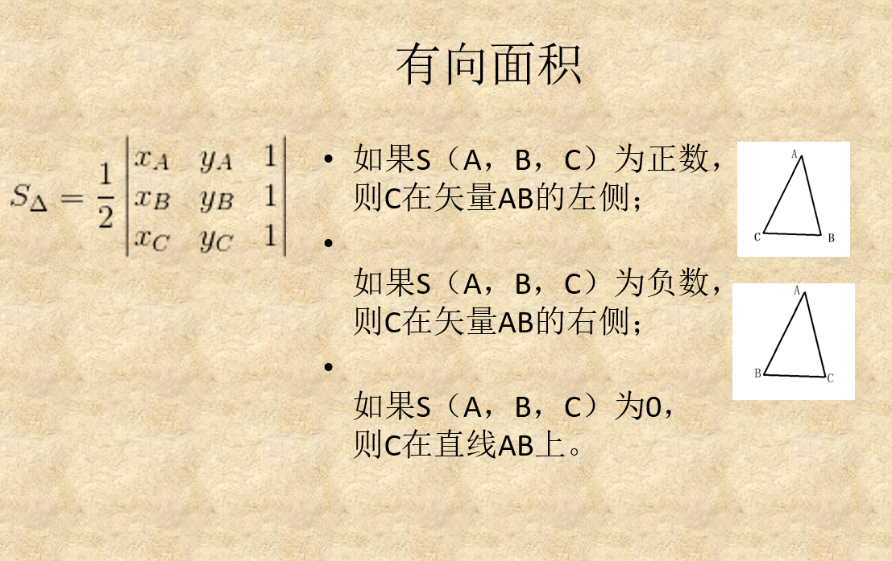

## 任务
1. 完成FractalDragon.cpp中的TODO
   - 最关键的是ToPoints函数
2. 提示，也可以用递归的方法来计算分形龙的顶点
3. 实现分形龙顶点的计算
4. 编译 `g++ -o main *.cpp`

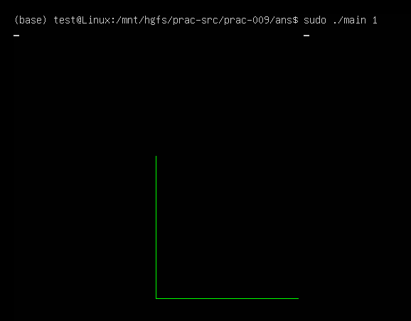
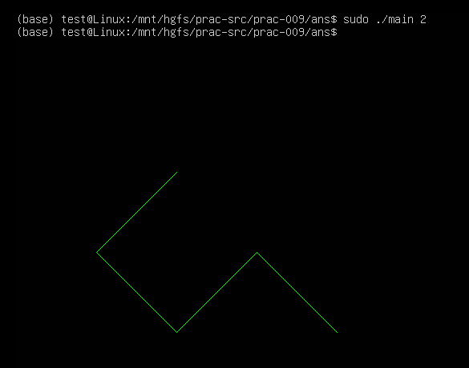
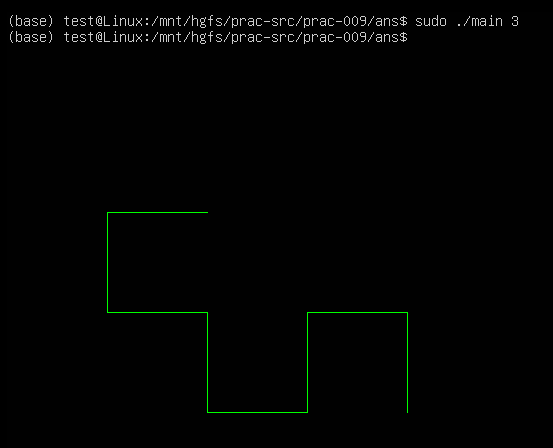
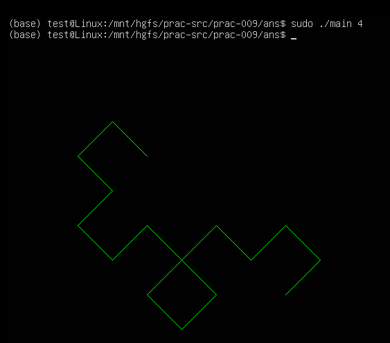
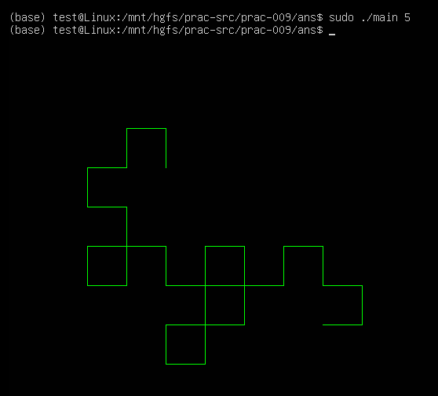
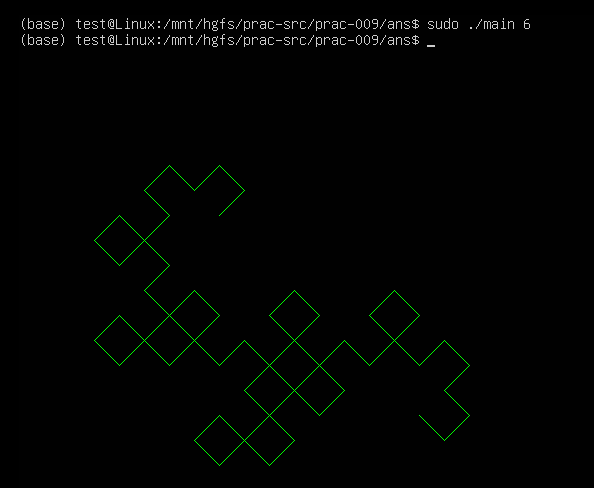
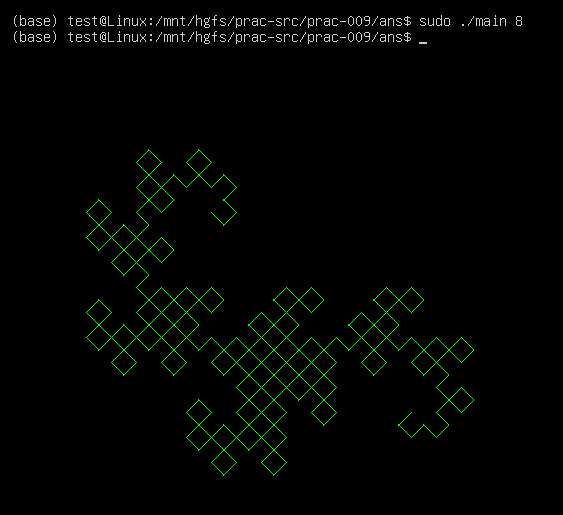
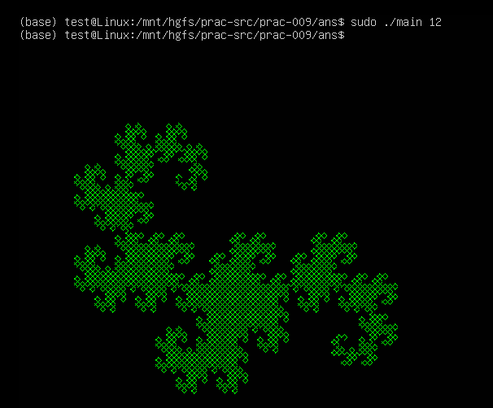
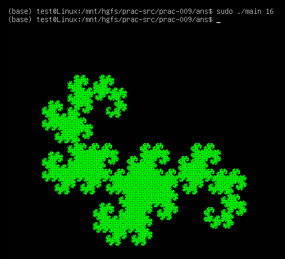

## 小结
1. CPoint 
2. CFractalDragon
3. CFramebuffer 
4. main 
 

