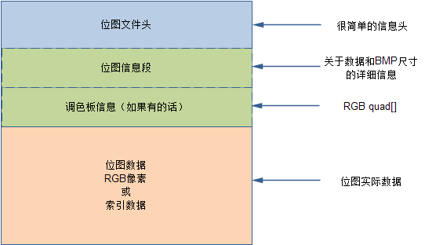

[TOC]

---
# bmp格式转换

## raw -> bmp 
1. 在第一个实践中，我们使用命令ffmpeg，把screen.raw转换成png图像文件
2. 我们也可以使用代码的方式把raw数据文件转换成普通图像文件
3. 这里我们选择最简单的，非压缩的图像格式bmp

### bmp 图像格式


### bmp 位图文件头
```cpp 
typedef struct tagBITMAPFILEHEADER 
{ 
unsigned short bfType;      //位图文件的类型，必须为 0x4d42
unsigned int bfSize;        //位图文件的大小，以字节为单位 
unsigned short bfReserved1; //位图文件保留字，必须为0 
unsigned short bfReserved2; //位图文件保留字，必须为0 
unsigned int bfOffBits;     //位图数据的起始位置，从文件头开始到位图数据之间的偏移量，以字节为单位  
}__attribute__((packed)) BITMAPFILEHEADER; 
```

### bmp 位图信息段
```cpp 
typedef struct tagBITMAPINFOHEADER{ 
unsigned int biSize;      //本结构所占用字节数 
int biWidth;              //位图的宽度，以像素为单位 
int biHeight;             //位图的高度，以像素为单位 
//注：这个值除了用于描述图像的高度之外，它还有另一个用处，就是指明该图像是倒向的位图，还是正向的位图。如果该值是一个正数，说明图像是倒向的，即：数据的第一行其实是图像的最后一行，如果该值是一个负数，则说明图像是正向的。大多数的BMP文件都是倒向的位图，也就是时，高度值是一个正数。
unsigned short biPlanes;  //表示bmp图片的平面数，显然显示器只有一个平面，所以恒等于1
unsigned short biBitCount;//每个像素所占bit数(色深)，其值为1、4、8、16、24、或32之一
unsigned int biCompression; //位图压缩类型，其值是 0(BI_RGB不压缩),1(BI_RLE8压缩类型)或2(BI_RLE4压缩类型)之一 
unsigned int biSizeImage; //位图的大小，以字节为单位 
int biXPelsPerMeter;      //位图水平分辨率，每米像素数 
int biYPelsPerMeter;      //位图垂直分辨率，每米像素数 
unsigned int biClrUsed;   //位图实际使用的颜色表中的颜色数，如果是0，则说明使用所有调色板项
unsigned int biClrImportant;//位图显示过程中重要的颜色数，如果是0，表示都重要
}__attribute__((packed)) BITMAPINFOHEADER;
```


## raw转bmp的原理
1. 打开一个空文件
2. 写入bmp 位图文件头
   - 位图文件头结构体需要设置正确的值
3. 写入bmp 位图信息段
   - 位图信息段结构体需要设置正确的值
4. 写入raw 数据
5. 关闭文件


## 测试 raw转bmp  
1. 先重复一下第一个实践prac-001的内容，作为参考标准 
3. 编译 `gcc raw2bmp.c -o raw2bmp`
4. 运行 `sudo ./raw2bmp c_screen.bmp`  
5. 查看c_screen.bmp图片内容，必须和第一个实践中的的screen-1.png，out.jpg一致
 
## 结合分形龙和bmp
1. 将分形龙绘制的代码和bmp转换的代码结合在一起
2. 完成 frac_bmp / Framebuffer.cpp 中的 SaveBmp() 函数 
3. main函数中 绘制成功分形龙后，保存图像成bmp格式
4. 编译 `g++ *.cpp -o main -lm`
5. 运行 `sudo ./main 5 xxx.bmp` 
6. 查看 xxx.bmp 是否生成，是否保存了5阶分形龙图像 


## 小结
1. open * 2
2. ioctl -> fb_var_screeninfo
3. read raw
4. set and write BITMAPFILEHEADER
5. set and write BITMAPINFOHEADER
6. write raw
7. close * 2


