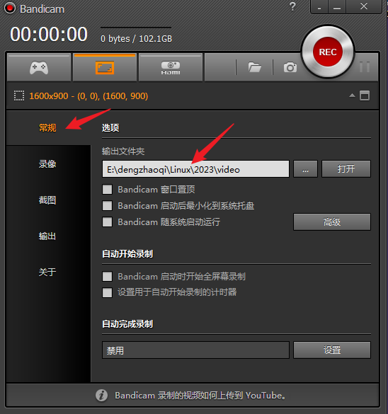

[TOC]

---
# 扩展任务 
利用已经完成的Framebuffer绘制分形龙的代码，扩展任意的功能，自由发挥。

## 注意事项
1. 一定要在已有的Framebuffer绘图系统上来完成拓展任务
2. 绝对不允许直接从网上复制代码
3. 可以参考他人的代码，理解他的思想，转化为自己的东西 

## 推荐扩展任务
1. 优化已有的绘图系统
   - 比如，对于线段，目前我们使用斜率来计算其中的每个点
   - 其中需要用到除法，既有精度问题，又存在效率问题
   - 是否有更加高效的算法呢？
   - 比如 Bresenham 直线算法
2. 在已有的绘图系统的基础上，绘制静态图形
   - 简单图形，比如圆，椭圆，曲线等 
   - 由简单图形综合构成的复杂图形，比如奥运五环，分形雪花等 
   - 提示，可以根据CGeometry类，派生出新的图形类，比如圆CCircle；复杂的图形则由简单图形耦合得到 
3. 实现图形的动态操作，比如旋转，平移，缩放
   - 提示，可以在CGeometry类中实现 
   - 平移就是图形整体所有点，从一个起点移动到另外一个终点
   - 旋转就是图形以某个点为中心，所有点旋转某一个角度
   - 缩放就是图形以某个点为中心，所有点之间的距离缩小或者放大一定的比例 
4. 在动态操作图形的基础上，实现图形的动画
   - 提示，动画是由静态图形按照时间先后展示得到
   - 可以通过 消除前一幅静态图形，显示后一幅静态图形的方式实现动画
   - 前后图形之间，可以利用休眠函数 usleep 实现时间先后的效果
   - 消除图形，可以通过把图形的颜色设置成黑色来实现 
5. 实现一些简单的游戏
   - 比如 贪吃蛇，碰碰车，泡泡龙等 
   - 提示，如果需要外部控制，可以考虑用多线程捕获键盘输入事件 
6. 实现可视化算法 
   - 比如 经典排序算法的可视化，冒泡排序等
   - 比如 递归算法的可视化，汉诺塔等 
7. 上一个实践，我们已经可以把framebuffer的数据直接保存成bmp图像文件
   - 我们可以反过来，实现一个读取bmp图像文件的功能，这样，就可以在framebuffer上显示bmp文件的内容了
   - 提示，在CFramebuffer中实现一个 LoadBmp()函数 
8. 其它自己感兴趣的，与图形绘制相关的东西 

## 扩展任务的提交
1. 直接提交到泛雅的作业，包括
   - 结果截图
   - 源代码
   - 动画的视频(如果有)
2. 扩展任务结果截图先直接上传到泛雅作业
3. 如果有动画，可以用 soft/Bandicam 录制视频
4. 再把截图，源代码和动画 做成zip压缩包
5. 以名字来命名压缩包，上传到泛雅作业
   - 如果是多人一组，则压缩包以多人的名字命名

## 录屏软件的使用
1. 解压缩，安装
   
2. 破解，以管理员身份运行
   
3. 随便输入一个邮箱地址
   
4. 打开软件
5. 设置录制结果的地址，根据实际情况设置
   
6. 设置录像的文件格式和视频的品质，全屏录制
   
7. 最小化主程序，用小控件来录制
   
   

# 完成实践报告
1. 最多三人一组，一组一份纸质报告，多人一组，写清楚每人的工作量
2. 必须使用Latex写报告，不能使用Word写报告

## 利用Latex撰写实践报告
1. 在线撰写环境[overleaf](https://cn.overleaf.com/)，首先注册账号
2. [实践报告Latex模板](https://gitee.com/yeyunxiaopan/zsc-cs-latex-prac)，下载源码，将其中的prac目录压缩成prac.zip
   - 或者从泛雅平台，Linux系统应用实训，资料中下载 prac.zip
3. [overleaf](https://cn.overleaf.com/)，创建新项目--上传项目--选择prac.zip
   - 注意，菜单--编译器--XeLaTex

## 实践报告Latex模板
1. frontinfo.tex 封面 
   - 修改其中的，专业，姓名学号，实践时间，等内容
2. prac-note.tex 实践记录 
3. prac-sum.tex 实践总结

## 实践记录 
1. 详细记录实践过程
2. 详细记录实践中遇到的问题，如何解决的
3. 尽量不要贴源代码，而是转成文字说明。除非为了说明某个问题的解决，必须做前后不同代码的对比
4. 实践结果图可以贴一两个
5. 程序设计的流程图，需求分析图，时序图等可以贴
6. 拓展任务也要详细记录
7. 多人一组的报告，要写清楚每个人完成的工作量 

## 实践总结
1. 简单总结实践完成之后的想法
   - 实践之前对Linux编程的理解
   - 实践之后对Linux编程的理解，二者的对比
   - 对今后编程的想法
   - 对今后使用Linux系统的想法
   - 等等，自由发挥

